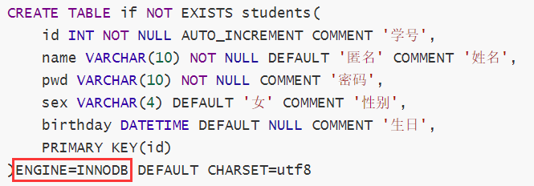
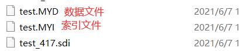
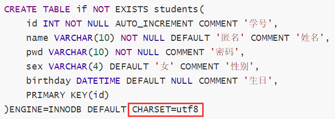
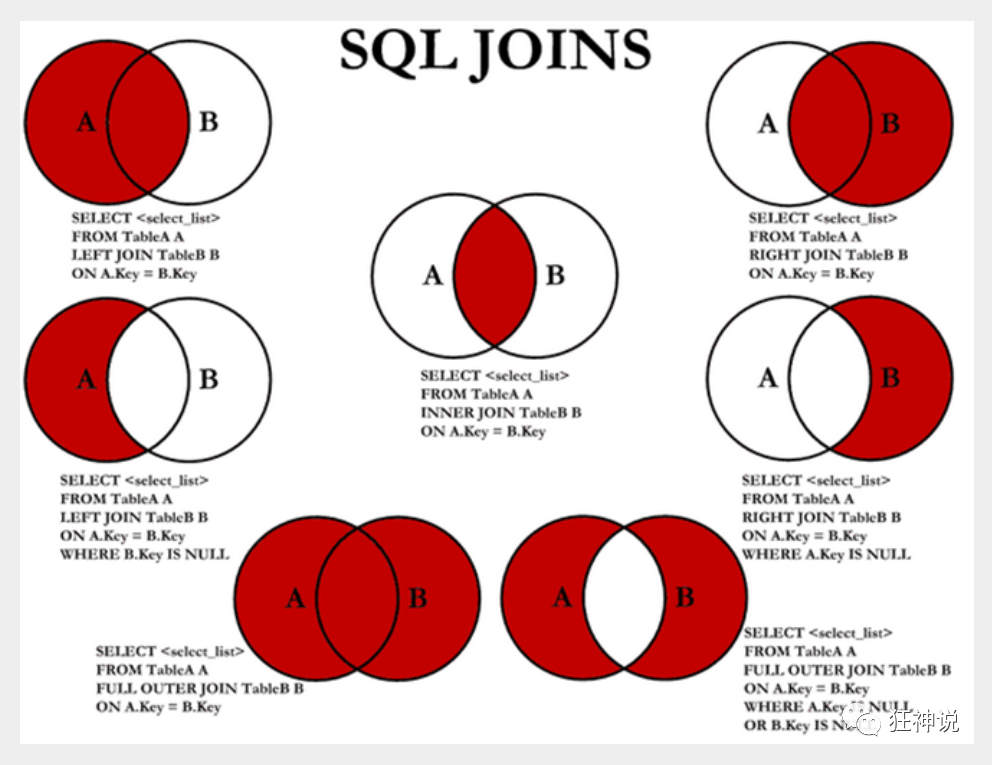

# 初识MySql

## 为什么要使用数据库

为了存储数据


## 数据库分类

### 关系型数据库（SQL）

- MySql，Oracle，Sql Server，DB2
- 通过表与表之间，行列之间的关系进行数据存储


### 非关系型数据库（NoSQL）

- Redis，MongDB
- 非关系型数据库，对象存储，通过对象的自身属性来决定


**DBMS（数据库管理系统）**

- 数据库管理软件，科学有效的管理我们的数据。维护和获取数据。

- MySQL -> 数据库管理系统


## MySQL

- 关系型数据库管理系统

### 安装

略

### 可视化工具安装

略


# 操作数据库

## 数据库的列类型

int、datetime、timestamp、varchar、null


## 数据库的字段属性

- Unsigned：无符号的整数，声明后不能为负数
- zerofill：0填充，不足的位数使用0来填充

- 自增：在上一条记录的基础上+1（默认），通常用来设置为唯一主键且必须是整数类型。也可以自定义设计主键自增的起始值和步长。
- 非空NotNull：如果不赋值就会报错
- 默认：设置默认的值，如果没有设置就会使用默认的值。


## 创建数据表

实例

```sql
CREATE TABLE if NOT EXISTS students(
	id INT NOT NULL AUTO_INCREMENT COMMENT '学号',
	name VARCHAR(10) NOT NULL DEFAULT '匿名' COMMENT '姓名',
	pwd VARCHAR(10) NOT NULL COMMENT '密码',
	sex VARCHAR(4) DEFAULT '女' COMMENT '性别',
	birthday DATETIME DEFAULT NULL COMMENT '生日',
	PRIMARY KEY(id)
)ENGINE=INNODB DEFAULT CHARSET=utf8
```

### 常用命令

```sql
show create database mydb		--查看创建数据库的语句
show create table students 		--查看student数据表的定义语句
desc students 					--显示表的结构
```


## 数据表的类型

### 数据库引擎

***ENGINE=INNODB***



- INNODB

- MYISAM

|            | MYISAM | INNODB         |
| ---------- | ------ | -------------- |
| 事务支持   | N      | Y              |
| 数据行锁定 | N      | Y              |
| 外键       | N      | Y              |
| 全文索引   | Y      | N              |
| 表空间大小 | 较小   | 较大，约为两倍 |

常规使用操作：

- MYISAM 节约空间、速度较快

- INNODB 安全性，事务处理，多表多用户


### 物理空间存在的位置

所有数据文件都在mysql的data文件夹下，一个文件夹对应一个数据库

本质还是文件的存储

MySql引擎在物理环境下的区别

- InnoDB 在数据表中只有一个.ibd文件
- MYISAM 对应文件
  - 


### 设置数据表的字符集编码

***CHARSET=utf8***



不设置的话，会是mysql默认的字符集编码

也可以在my.ini中配置默认的编码


# MySql数据管理

## 外键

- 方式一：在创建表的时候增加约束
- 方式二：创建表成功后，添加外键

这两种方式都是物理外键，数据库级别的外键，不建议使用。

建议：

​	数据库只有表，只用来存储数据。如果需要外键，则在程序中实现。


## DML语言

数据操作语言

### insert

注意事项：字段之间使用英文逗号隔开。字段可以省略，但是后面的值必须对应。可以同时插入多条数据，使用逗号隔开。


### update

update 修改谁 （条件） set 原来的值=新的值

没有指定修改的条件则会修改所有的列

多个设置的属性之间，使用英文逗号隔开


### delete 

与truncate的区别

truncate：完全清空一个数据库表，表的结构和索引都不会表

相同：都能删除数据，不会删除表结构

不同点：truncate重新设置自增初始值，且不影响事务


了解：delete删除，重启数据库现象

- InnoDB 自增列会从1开始（存在内存当中的，断电即失）
- MyISAM 继续从上一个字增量开始（存在文档中的，不会丢失）


## DQL语言

- as 别名

- 去重 
  - select distinct * from table
- 数据库中的表达式：文本值，列，null，函数，计算表达式，系统变量

### SELECT语法

```sql
SELECT [ALL | DISTINCT]
{* | table.* | [table.field1[as alias1][,table.field2[as alias2]][,...]]}
FROM table_name [as table_alias]
  [left | right | inner join table_name2]  -- 联合查询
  [WHERE ...]  -- 指定结果需满足的条件
  [GROUP BY ...]  -- 指定结果按照哪几个字段来分组
  [HAVING]  -- 过滤分组的记录必须满足的次要条件
  [ORDER BY ...]  -- 指定查询记录按一个或多个条件排序
  [LIMIT {[offset,]row_count | row_countOFFSET offset}];
   -- 指定查询的记录从哪条至哪条
```

**注意 : [ ] 括号代表可选的 , { }括号代表必选得**


### 连接查询

> JOIN 对比


七种Join：




如需要多张数据表的数据进行查询,则可通过连接运算符实现多个查询

#### 内连接 inner join

   查询两个表中的结果集中的交集

#### 外连接 outer join

#### 左外连接 left join

​	 (以左表作为基准,右边表来一一匹配,匹配不上的,返回左表的记录,右表以NULL填充)

#### 右外连接 right join

​	(以右表作为基准,左边表来一一匹配,匹配不上的,返回右表的记录,左表以NULL填充)

#### 自连接

数据表与自身进行连接

需求:从一个包含栏目ID , 栏目名称和父栏目ID的表中
		 查询父栏目名称和其他子栏目名称

### 分页查询

limit


### 排序查询

order by 字段 asc

- 升序 asc
- 降序 desc


### 子查询

在where语句中，嵌套一个子查询语句


### 分组

group by


### 过滤

having


# 函数

## 常用函数

**数据函数**

```sql
 SELECT ABS(-8);  /*绝对值*/
 SELECT CEILING(9.4); /*向上取整*/
 SELECT FLOOR(9.4);   /*向下取整*/
 SELECT RAND();  /*随机数,返回一个0-1之间的随机数*/
 SELECT SIGN(0); /*符号函数: 负数返回-1,正数返回1,0返回0*/
```

**字符串函数**

```sql
 SELECT CHAR_LENGTH('狂神说坚持就能成功'); /*返回字符串包含的字符数*/
 SELECT CONCAT('我','爱','程序');  /*合并字符串,参数可以有多个*/
 SELECT INSERT('我爱编程helloworld',1,2,'超级热爱');  /*替换字符串,从某个位置开始替换某个长度*/
 SELECT LOWER('KuangShen'); /*小写*/
 SELECT UPPER('KuangShen'); /*大写*/
 SELECT LEFT('hello,world',5);   /*从左边截取*/
 SELECT RIGHT('hello,world',5);  /*从右边截取*/
 SELECT REPLACE('狂神说坚持就能成功','坚持','努力');  /*替换字符串*/
 SELECT SUBSTR('狂神说坚持就能成功',4,6); /*截取字符串,开始和长度*/
 SELECT REVERSE('狂神说坚持就能成功'); /*反转
 
 -- 查询姓周的同学,改成邹
 SELECT REPLACE(studentname,'周','邹') AS 新名字
 FROM student WHERE studentname LIKE '周%';
```

**日期和时间函数**

```sql
 SELECT CURRENT_DATE();   /*获取当前日期*/
 SELECT CURDATE();   /*获取当前日期*/
 SELECT NOW();   /*获取当前日期和时间*/
 SELECT LOCALTIME();   /*获取当前日期和时间*/
 SELECT SYSDATE();   /*获取当前日期和时间*/
 
 -- 获取年月日,时分秒
 SELECT YEAR(NOW());
 SELECT MONTH(NOW());
 SELECT DAY(NOW());
 SELECT HOUR(NOW());
 SELECT MINUTE(NOW());
 SELECT SECOND(NOW());
```

**系统信息函数**

```sql
 SELECT VERSION();  /*版本*/
 SELECT USER();     /*用户*/
```


## 聚合函数

| 函数名称 | 描述                                                         |
| -------- | ------------------------------------------------------------ |
| COUNT()  | 返回满足Select条件的记录总和数，如 select count(*) 【不建议使用 *，效率低】 |
| SUM()    | 返回数字字段或表达式列作统计，返回一列的总和。               |
| AVG()    | 通常为数值字段或表达列作统计，返回一列的平均值               |
| MAX()    | 可以为数值字段，字符字段或表达式列作统计，返回最大的值。     |
| MIN()    | 可以为数值字段，字符字段或表达式列作统计，返回最小的值。     |


## 数据库级别的MD5加密

主要增强算法复杂度和不可逆性

MD5不可逆具体的md5值是一样的

在数据库中使用MD5()函数

示例：

```sql
UPDATE test SET pwd=MD5(pwd)

INSERT INTO test VALUES(5,'lisi',MD5('112'))
```


# 事务

原则：原子性、一致性、隔离性、持久性

脏读、幻读、不可重复读


数据库中示例：

```sql
-- 使用set语句来改变自动提交模式
SET autocommit = 0;   /*关闭*/
SET autocommit = 1;   /*开启*/

-- 注意:
--- 1.MySQL中默认是自动提交
--- 2.使用事务时应先关闭自动提交

-- 开始一个事务,标记事务的起始点
START TRANSACTION  

-- 提交一个事务给数据库
COMMIT

-- 将事务回滚,数据回到本次事务的初始状态
ROLLBACK

-- 还原MySQL数据库的自动提交
SET autocommit =1;

-- 保存点
SAVEPOINT 保存点名称 -- 设置一个事务保存点
ROLLBACK TO SAVEPOINT 保存点名称 -- 回滚到保存点
RELEASE SAVEPOINT 保存点名称 -- 删除保存点
```

经典例子：银行转账


# 索引

> 索引是帮助MySQL高效获取数据的数据结构。提取句子主干，就可以得到索引本质：索引就是数据结构

## 分类

> 一张表主键索引只能有一个，唯一索引可以有多个

- 主键索引（PRIMARY KEY）
  - 唯一标识，主键不可重复，只能有一列作为索引
- 唯一索引（UNIQUE KEY）
  - 避免重复的列出现
  - 可以多个列都为唯一索引
- 常规索引（KEY、INDEX）
  - 默认的。使用index、key设置
- 全文索引（FullText）
  - 在特定的数据库引擎下


索引在数据量小的时候，作用不大，但是在数据量大的时候，区别十分明显


## 原则

- 索引不是越多越好
- 不要对经常变动的数据加索引
- 小数据量就不需要加索引
- 索引一般加在常用来查询的字段上


## 索引的数据结构

B树

B+树


# 权限管理和备份

## 用户管理

```sql
/* 用户和权限管理 */ ------------------
用户信息表：mysql.user

-- 刷新权限
FLUSH PRIVILEGES

-- 增加用户 CREATE USER kuangshen IDENTIFIED BY '123456'
CREATE USER 用户名 IDENTIFIED BY [PASSWORD] 密码(字符串)
  - 必须拥有mysql数据库的全局CREATE USER权限，或拥有INSERT权限。
  - 只能创建用户，不能赋予权限。
  - 用户名，注意引号：如 'user_name'@'192.168.1.1'
  - 密码也需引号，纯数字密码也要加引号
  - 要在纯文本中指定密码，需忽略PASSWORD关键词。要把密码指定为由PASSWORD()函数返回的混编值，需包含关键字PASSWORD

-- 重命名用户 RENAME USER kuangshen TO kuangshen2
RENAME USER old_user TO new_user

-- 设置密码
SET PASSWORD = PASSWORD('密码')    -- 为当前用户设置密码
SET PASSWORD FOR 用户名 = PASSWORD('密码')    -- 为指定用户设置密码

-- 删除用户 DROP USER kuangshen2
DROP USER 用户名

-- 分配权限/添加用户
GRANT 权限列表 ON 表名 TO 用户名 [IDENTIFIED BY [PASSWORD] 'password']
  - all privileges 表示所有权限
  - *.* 表示所有库的所有表
  - 库名.表名 表示某库下面的某表

-- 查看权限   SHOW GRANTS FOR root@localhost;
SHOW GRANTS FOR 用户名
   -- 查看当前用户权限
  SHOW GRANTS; 或 SHOW GRANTS FOR CURRENT_USER; 或 SHOW GRANTS FOR CURRENT_USER();

-- 撤消权限
REVOKE 权限列表 ON 表名 FROM 用户名
REVOKE ALL PRIVILEGES, GRANT OPTION FROM 用户名    -- 撤销所有权限
```

> 权限解释

```sql
-- 权限列表
ALL [PRIVILEGES]    -- 设置除GRANT OPTION之外的所有简单权限
ALTER    -- 允许使用ALTER TABLE
ALTER ROUTINE    -- 更改或取消已存储的子程序
CREATE    -- 允许使用CREATE TABLE
CREATE ROUTINE    -- 创建已存储的子程序
CREATE TEMPORARY TABLES        -- 允许使用CREATE TEMPORARY TABLE
CREATE USER        -- 允许使用CREATE USER, DROP USER, RENAME USER和REVOKE ALL PRIVILEGES。
CREATE VIEW        -- 允许使用CREATE VIEW
DELETE    -- 允许使用DELETE
DROP    -- 允许使用DROP TABLE
EXECUTE        -- 允许用户运行已存储的子程序
FILE    -- 允许使用SELECT...INTO OUTFILE和LOAD DATA INFILE
INDEX     -- 允许使用CREATE INDEX和DROP INDEX
INSERT    -- 允许使用INSERT
LOCK TABLES        -- 允许对您拥有SELECT权限的表使用LOCK TABLES
PROCESS     -- 允许使用SHOW FULL PROCESSLIST
REFERENCES    -- 未被实施
RELOAD    -- 允许使用FLUSH
REPLICATION CLIENT    -- 允许用户询问从属服务器或主服务器的地址
REPLICATION SLAVE    -- 用于复制型从属服务器（从主服务器中读取二进制日志事件）
SELECT    -- 允许使用SELECT
SHOW DATABASES    -- 显示所有数据库
SHOW VIEW    -- 允许使用SHOW CREATE VIEW
SHUTDOWN    -- 允许使用mysqladmin shutdown
SUPER    -- 允许使用CHANGE MASTER, KILL, PURGE MASTER LOGS和SET GLOBAL语句，mysqladmin debug命令；允许您连接（一次），即使已达到max_connections。
UPDATE    -- 允许使用UPDATE
USAGE    -- “无权限”的同义词
GRANT OPTION    -- 允许授予权限


/* 表维护 */

-- 分析和存储表的关键字分布
ANALYZE [LOCAL | NO_WRITE_TO_BINLOG] TABLE 表名 ...
-- 检查一个或多个表是否有错误
CHECK TABLE tbl_name [, tbl_name] ... [option] ...
option = {QUICK | FAST | MEDIUM | EXTENDED | CHANGED}
-- 整理数据文件的碎片
OPTIMIZE [LOCAL | NO_WRITE_TO_BINLOG] TABLE tbl_name [, tbl_name] ...
```


## 备份

### 数据库备份必要性

- 保证重要数据不丢失
- 数据转移


### MySQL数据库备份方法

- mysqldump备份工具
- 数据库管理工具,如SQLyog
- 直接拷贝数据库文件和相关配置文件


```sql
-- 导出
1. 导出一张表 -- mysqldump -uroot -p123456 school student >D:/a.sql
　　mysqldump -u用户名 -p密码 库名 表名 > 文件名(D:/a.sql)
2. 导出多张表 -- mysqldump -uroot -p123456 school student result >D:/a.sql
　　mysqldump -u用户名 -p密码 库名 表1 表2 表3 > 文件名(D:/a.sql)
3. 导出所有表 -- mysqldump -uroot -p123456 school >D:/a.sql
　　mysqldump -u用户名 -p密码 库名 > 文件名(D:/a.sql)
4. 导出一个库 -- mysqldump -uroot -p123456 -B school >D:/a.sql
　　mysqldump -u用户名 -p密码 -B 库名 > 文件名(D:/a.sql)

可以-w携带备份条件

-- 导入
1. 在登录mysql的情况下：-- source D:/a.sql
　　source 备份文件
2. 在不登录的情况下
　　mysql -u用户名 -p密码 库名 < 备份文件
```


# 规范化数据库设计

## 为什么需要数据库设计

**当数据库比较复杂时我们需要设计数据库**

**糟糕的数据库设计 :** 

- 数据冗余,存储空间浪费
- 数据更新和插入的异常
- 程序性能差

**良好的数据库设计 :** 

- 节省数据的存储空间
- 能够保证数据的完整性
- 方便进行数据库应用系统的开发

 **软件项目开发周期中数据库设计 :**

- 需求分析阶段: 分析客户的业务和数据处理需求
- 概要设计阶段:设计数据库的E-R模型图 , 确认需求信息的正确和完整.

**设计数据库步骤**

- 收集信息

- - 与该系统有关人员进行交流 , 座谈 , 充分了解用户需求 , 理解数据库需要完成的任务.

- 标识实体[Entity]

- 标识数据库要管理的关键对象或实体,实体一般是名词

- 标识每个实体需要存储的详细信息[Attribute]

- 标识实体之间的关系[Relationship]


## 三大范式

### 为什么需要数据规范化?

不合规范的表设计会导致的问题：

- 信息重复

- 更新异常

- 插入异常

- - 无法正确表示信息

- 删除异常

- - 丢失有效信息

> 三大范式

### **第一范式 (1st NF)**

第一范式的目标是确保每列的原子性,如果每列都是不可再分的最小数据单元,则满足第一范式

### **第二范式(2nd NF)**

第二范式（2NF）是在第一范式（1NF）的基础上建立起来的，即满足第二范式（2NF）必须先满足第一范式（1NF）。

第二范式要求每个表只描述一件事情

### **第三范式(3rd NF)**

如果一个关系满足第二范式,并且除了主键以外的其他列都不传递依赖于主键列,则满足第三范式.

第三范式需要确保数据表中的每一列数据都和主键直接相关，而不能间接相关。


## **规范化和性能的关系**

为满足某种商业目标 , 数据库性能比规范化数据库更重要

在数据规范化的同时 , 要综合考虑数据库的性能

通过在给定的表中添加额外的字段,以大量减少需要从中搜索信息所需的时间

通过在给定的表中插入计算列,以方便查询