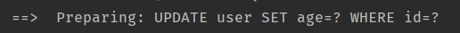
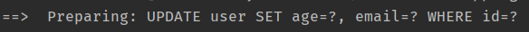
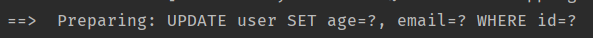
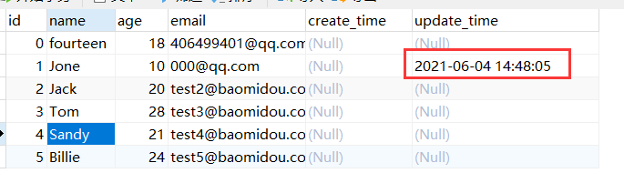
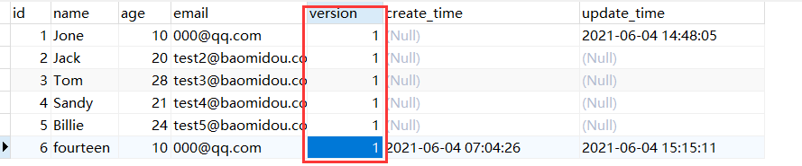
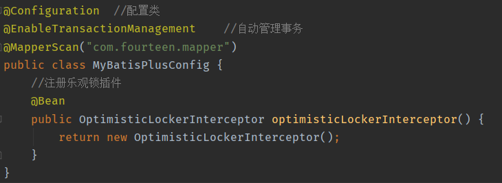
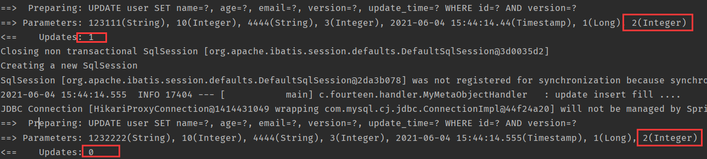
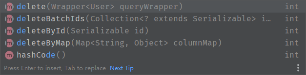
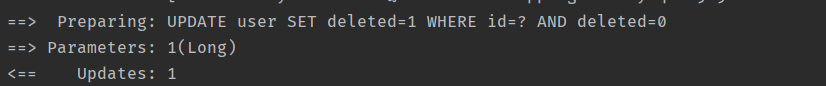

# MyBatisPlus概述

是一个 MyBatis的增强工具，在 MyBatis 的基础上只做增强不做改变，为简化开发、提高效率而生。

注意：不要同时导入mybatis和mybatisplus


# 快速开始

- 创建数据库
- 导入对应依赖

```xml
<dependency>
	<groupId>mysql</groupId>
	<artifactId>mysql-connector-java</artifactId>
</dependency>
<dependency>
	<groupId>com.baomidou</groupId>
	<artifactId>mybatis-plus-boot-starter</artifactId>
	<version>3.0.5</version>
</dependency>
```

- 链接数据库（application.yml）

```yml
# DataSource Config
spring:
  datasource:
    username: root
    password: 2000107ksz
    url: jdbc:mysql://localhost:3306/mydb?serverTimezone=Asia/Shanghai
    driver-class-name: com.mysql.cj.jdbc.Driver
```

- ~~pojo-dao（链接mybatis，配置mapper）-server-controller~~

- 使用mybatisplus后
  - pojo
  - mapper接口

```java
//在对应的mapper上面继承基本的类BaseMapper
@Repository 
//@Mapper
public interface UserMapper extends BaseMapper<User> {
    //所有CRUD已自动完成
}
```

*注：@Repository 	和     @Mapper区别*

*@Repository需要在 Spring中配置扫描地址，然后生成 Dao层的 Bean才能被注入到 Service层中。*

*@Mapper不需要配置扫描地址，通过xml里面的 namespace里面的接口地址，生成了 Bean后注入到 Service层中。如果有多个mapper文件的话，可以在项目启动类中加入@MapperScan(“mapper文件所在包”)，这样就不需要每个mapper文件都加@Mapper注解了*

- 在启动类上加上mapperScan

```java
@SpringBootApplication
@MapperScan("com.fourteen.mapper")
public class MybatispulsApplication {

    public static void main(String[] args) {
        SpringApplication.run(MybatispulsApplication.class, args);
    }

}

```


# 进阶使用

## 配置日志

所有sql不可见，希望知道它是怎么执行的，所以需要使用日志。

```yml
#配置日志
mybatis-plus:
  configuration:
    log-impl: org.apache.ibatis.logging.stdout.StdOutImpl
```


## CRUD扩展

### insert插入

数据库插入的id默认值为：全局唯一id

#### 主键生成策略

##### ID_WORKER

```java
@TableId(type = IdType.ID_WORKER)
```

###### 雪花算法

算法原理

SnowFlake算法生成id的结果是一个64bit大小的整数，它的结构如下图：


结构图

1. **1bit**，不用，因为二进制中最高位是符号位，1表示负数，0表示正数。生成的id一般都是用整数，所以最高位固定为0。
2. **41bit-时间戳**，用来记录时间戳，毫秒级。
    \- 41位可以表示个数字，
    \- 如果只用来表示正整数（计算机中正数包含0），可以表示的数值范围是：0 至 ，减1是因为可表示的数值范围是从0开始算的，而不是1。
    \- 也就是说41位可以表示个毫秒的值，转化成单位年则是%20%2F%20(1000%20*%2060%20*%2060%20*%2024%20*365)%20%3D%2069)年
3. **10bit-工作机器id**，用来记录工作机器id。
    \- 可以部署在个节点，包括5位datacenterId和5位workerId
    \- 5位（bit）可以表示的最大正整数是，即可以用0、1、2、3、....31这32个数字，来表示不同的datecenterId或workerId
4. **12bit-序列号**，序列号，用来记录同毫秒内产生的不同id。
    \-  12位（bit）可以表示的最大正整数是，即可以用0、1、2、3、....4094这4095个数字，来表示同一机器同一时间截（毫秒)内产生的4095个ID序号。

由于在Java中64bit的整数是long类型，所以在Java中SnowFlake算法生成的id就是long来存储的。

**SnowFlake可以保证：**

> 1. 所有生成的id按时间趋势递增
> 2. 整个分布式系统内不会产生重复id（因为有datacenterId和workerId来做区分）


##### AUTO自增

```java
@TableId(type = IdType.AUTO)
```

需要设置数据库字段为自增


##### 其他的主键生成策略

```java
	/**数据库ID自增*/
    AUTO(0),
    /**该类型为未设置主键类型*/
    NONE(1),
    /** 用户输入ID
     * 该类型可以通过自己注册自动填充插件进行填充*/
    INPUT(2),

    /* 以下3种类型、只有当插入对象ID为空，才自动填充。 */
    /** 全局唯一ID (idWorker)*/
    ID_WORKER(3),
    /** 全局唯一ID (UUID) */
    UUID(4),
    /**字符串全局唯一ID (idWorker 的字符串表示)*/
    ID_WORKER_STR(5);
```


### update更新





自动拼接sql，实现了自动的动态sql


### 自动填充

创建时间、修改时间，应为自动完成。

- 方式一：数据库

  1. 在表中新增字段create_time,update_time，并且增加自动更新当前时间戳功能

  2. ```java
     private Date createTime;
     private Date updateTime;
     ```

     

     

- 方式二：代码级别

  1. 在属性上增加注解

     ```java
     //字段添加填充内容
     @TableField(fill = FieldFill.INSERT)
     private Date createTime;
     //字段插入和更新的时候填充内容
     @TableField(fill = FieldFill.INSERT_UPDATE)
     private Date updateTime;
     ```

  2. 编写处理器处理注解

     ```java
     @Slf4j
     @Component  //一定不要忘记把处理器加到IOC容器中
     public class MyMetaObjectHandler implements MetaObjectHandler {
         //插入时的填充策略
         @Override
         public void insertFill(MetaObject metaObject) {
             log.info("start insert fill ....");
             this.setFieldValByName("createTime",new Date(),metaObject);
             this.setFieldValByName("updateTime",new Date(),metaObject);
         }
     
         //更新时的填充策略
         @Override
         public void updateFill(MetaObject metaObject) {
             log.info("update insert fill ....");
             this.setFieldValByName("updateTime",new Date(),metaObject);
         }
     }
     ```

     以下为官网方法：

     ```java
     @Slf4j
     @Component
     public class MyMetaObjectHandler implements MetaObjectHandler {
     
         @Override
         public void insertFill(MetaObject metaObject) {
             log.info("start insert fill ....");
             this.strictInsertFill(metaObject, "createTime", LocalDateTime.class, LocalDateTime.now()); // 起始版本 3.3.0(推荐使用)
             // 或者
             this.strictInsertFill(metaObject, "createTime", () -> LocalDateTime.now(), LocalDateTime.class); // 起始版本 3.3.3(推荐)
             // 或者
             this.fillStrategy(metaObject, "createTime", LocalDateTime.now()); // 也可以使用(3.3.0 该方法有bug)
         }
     
         @Override
         public void updateFill(MetaObject metaObject) {
             log.info("start update fill ....");
             this.strictUpdateFill(metaObject, "updateTime", LocalDateTime.class, LocalDateTime.now()); // 起始版本 3.3.0(推荐)
             // 或者
             this.strictUpdateFill(metaObject, "updateTime", () -> LocalDateTime.now(), LocalDateTime.class); // 起始版本 3.3.3(推荐)
             // 或者
             this.fillStrategy(metaObject, "updateTime", LocalDateTime.now()); // 也可以使用(3.3.0 该方法有bug)
         }
     }
     ```

     

### 乐观锁

乐观锁：顾名思义，它总是认为不会出现问题，无论干什么都不上锁。如果出现问题就再测试。

悲观锁：顾名思义，它总是认为会出现问题，无论干什么都会上锁，再去上锁。

#### 乐观锁实现方式

> - 取出记录时，获取当前version
> - 更新时，带上这个version
> - 执行更新时， set version = newVersion where version = oldVersion
> - 如果version不对，就更新失败

类似于**CAS**

#### 测试实现

1. 增加表字段version
2. 实体类增加字段

```java
@Version    //乐观锁注解
private Integer version;
```

3. 注册组件

   

   ```java
   // Spring Boot 方式
   @Configuration
   @MapperScan("按需修改")
   public class MybatisPlusConfig {
       /**旧版*/
       @Bean
       public OptimisticLockerInterceptor optimisticLockerInterceptor() {
           return new OptimisticLockerInterceptor();
       }
       
       /**新版*/
       @Bean
       public MybatisPlusInterceptor mybatisPlusInterceptor() {
           MybatisPlusInterceptor mybatisPlusInterceptor = new MybatisPlusInterceptor();
           mybatisPlusInterceptor.addInnerInterceptor(new OptimisticLockerInnerInterceptor());
           return mybatisPlusInterceptor;
       }
   }
   ```

4. 测试

```java
@Test
public void testVersion2() {
    //线程1
    //查询用户信息
    User user = userMapper.selectById(1L);
    //修改用户信息
    user.setName("1232222");
    user.setEmail("4444");

    //模拟另外一个线程进行插队
    User user2 = userMapper.selectById(1L);
    user2.setName("123111");
    userMapper.updateById(user2);

    userMapper.updateById(user);
}
```




### query查询

#### 批量查询

```java
@Test
public void testBatchQuery(){
    List<User> list = userMapper.selectBatchIds(Arrays.asList(1, 2, 3));
    list.forEach(System.out::println);
}
```

#### 条件查询

- 使用map操作（不常用）

```java
@Test
public void testMapQuery(){
    HashMap<String, Object> hashMap = new HashMap<>();
    hashMap.put("name","fourteen");
    List<User> list = userMapper.selectByMap(hashMap);
    list.forEach(System.out::println);
}
```

#### 分页查询

1. limit分页
2. 第三方插件
3. MyBatisPlus内置分页插件PaginationInnerInterceptor


### 删除操作

和查询类似



#### 逻辑删除

- 物理删除：从数据库中直接移除
- 逻辑删除：在数据库中没有被移除，而是通过一个变量让其失效

管理员可以查看被删除的数据，防止数据丢失，类似于回收站。

1. 在数据库中添加字段delete

2. 在实体类中添加属性

   ```java
   @TableLogic //逻辑删除
   private Integer delete;
   ```

3. 配置

```yml
mybatis-plus:
  global-config:
    db-config:
      logic-delete-field: flag  # 全局逻辑删除的实体字段名(since 3.3.0,配置后可以忽略配置步骤2)
      logic-delete-value: 1 # 逻辑已删除值(默认为 1)
      logic-not-delete-value: 0 # 逻辑未删除值(默认为 0)
```

执行的为删除操作实际为更新操作



再次查询的时候被自动过滤


## 性能分析插件

**（官方推荐Druid等工具执行sql的性能分析）**

~~在平时的开发中，会遇到很多的慢sql。~~

~~所以Mybatispuls也提供了性能分析插件，如果超过这个时间就停止运行。~~

1. ~~导入插件IllegalSQLInnerInterceptor~~
2. ~~测试使用~~


## 条件构造器

Wapper

### 简单示例

```java
@Test
public void test01(){
    //查询name不为空并且邮箱不为空并且年龄》=12
    QueryWrapper<User> wrapper = new QueryWrapper<>();
    wrapper.isNotNull("name")
            .isNotNull("email")
            .ge("age",12);
    List<User> list = userMapper.selectList(wrapper);
    list.forEach(System.out::println);
}
```

### 说明

- 以下出现的第一个入参`boolean condition`表示该条件**是否**加入最后生成的sql中，例如：query.like(StringUtils.isNotBlank(name), Entity::getName, name) .eq(age!=null && age >= 0, Entity::getAge, age)
- 以下代码块内的多个方法均为从上往下补全个别`boolean`类型的入参,默认为`true`
- 以下出现的泛型`Param`均为`Wrapper`的子类实例(均具有`AbstractWrapper`的所有方法)
- 以下方法在入参中出现的`R`为泛型,在普通wrapper中是`String`,在LambdaWrapper中是**函数**(例:`Entity::getId`,`Entity`为实体类,`getId`为字段`id`的**getMethod**)
- 以下方法入参中的`R column`均表示数据库字段,当`R`具体类型为`String`时则为数据库字段名(**字段名是数据库关键字的自己用转义符包裹!**)!而不是实体类数据字段名!!!,另当`R`具体类型为`SFunction`时项目runtime不支持eclipse自家的编译器!!!
- 以下举例均为使用普通wrapper,入参为`Map`和`List`的均以`json`形式表现!
- 使用中如果入参的`Map`或者`List`为**空**,则不会加入最后生成的sql中!!!
- 有任何疑问就点开源码看,看不懂**函数**的[点击我学习新知识(opens new window)](https://www.jianshu.com/p/613a6118e2e0)

### 警告

不支持以及不赞成在 RPC 调用中把 Wrapper 进行传输

1. wrapper 很重
2. 传输 wrapper 可以类比为你的 controller 用 map 接收值(开发一时爽,维护火葬场)
3. 正确的 RPC 调用姿势是写一个 DTO 进行传输,被调用方再根据 DTO 执行相应的操作
4. 我们拒绝接受任何关于 RPC 传输 Wrapper 报错相关的 issue 甚至 pr

### 常用函数

#### having

```java
having(String sqlHaving, Object... params)
having(boolean condition, String sqlHaving, Object... params)
```

- HAVING ( sql语句 )
- 例: `having("sum(age) > 10")`--->`having sum(age) > 10`
- 例: `having("sum(age) > {0}", 11)`--->`having sum(age) > 11`

#### func

```java
func(Consumer<Children> consumer)
func(boolean condition, Consumer<Children> consumer)
```

- func 方法(主要方便在出现if...else下调用不同方法能不断链)
- 例: `func(i -> if(true) {i.eq("id", 1)} else {i.ne("id", 1)})`


