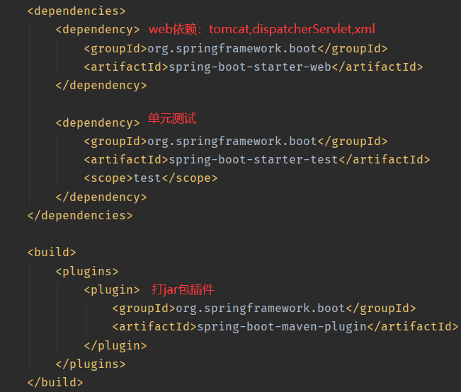
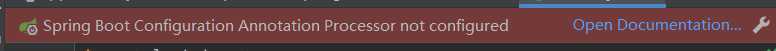
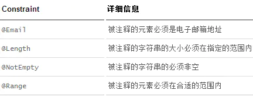

# SpringBoot入门

## 什么是SpringBoot

- javaweb的开发框架
- 简化开发，**约定大于配置**
- 开箱即用


## 微服务

一种架构风格


## 单体应用架构

一个应用中的所有服务都封装在一个应用中


## 微服务架构

让服务独立。把独立出来的功能元素动态组合，需要的功能元素才组合，需要多一些时间以整合多个功能元素。

微服务架构是对功能元素进行复制，而没有对整个应用进行复制。

好处：

- 节省了调用资源
- 每个功能元素都是一个可替换的、可独立升级的软件代码

[MartinFowler关于微服务架构论文（中文版）](https://www.cnblogs.com/liuning8023/p/4493156.html)


# 第一个程序

## 创建

- 官方提供了一个快速生成的网站

- IDEA提供


## 初始文件说明

- xxxxApplication --->程序主入口 本身就是Spring的一个组件

- application.properties --->springboot核心配置文件

- xxxxApplicationTests --->单元测试

- pom.xml文件




## 测试

在xxxApplication**同级目录**下创建controller\service\dao\pojo等包


## Skills

- 更改端口号

  在application.properties中添加如下代码

```java
server.port=8081
```

- 修改banner

  在网络上寻找banner自动生成器，将生成好的banner复制

  在application.properties同级目录下创建banner.txt，将刚才复制的banner文本放入

  重启spring


# 原理初探*

pom.xml

- spring-boot-dependencies：核心依赖在父工程中
- 不需要指定版本就是因为有依赖


启动器


主程序

```java
//@SpringBootApplication:标注这个类是一个springboot的应用
@SpringBootApplication
public class Springboot01HelloworldApplication {
    public static void main(String[] args) {
        //将springboot应用启动
        SpringApplication.run(Springboot01HelloworldApplication.class, args);
    }
}
```

- 注解

  - ```java
    @SpringBootConfiguration：springboot 的配置
    	@Configuration：spring配置类
    @EnableAutoConfiguration：自动配置
        @AutoConfigurationPackage：自动配置包
        @Import(AutoConfigurationImportSelector.class)：导入了选择器
    ```

- run


# 配置文件

## yaml配置文件

### 语法结构

key: *空格*value

**对空格的要求十分高**

可以注入到配置类

```java
# 普通的key-value
server:
  port: 8081

# 对象
student1:
  name: fourteen
  age: 3

#行内写法
student2: {name: fourteen,age: 3}

#数组
pets:
  - cat
  - dog
  - pig

#数组行内写法
pets:[cat,dao,pig]
```


## 配置文件给实体类赋值

### 使用yaml文件

```java
//可以使用配置文件中的属性给加了此注解的类赋值
//将配置文件中配置的每一个属性的值，映射到这个组件中
//告诉SpringBoot将本类中所有的属性和配置文件中相关的配置进行绑定
//只有这个组件是容器中的组件，才能使用容器提供的@ConfigurationProperties功能
@ConfigurationProperties(prefix = "配置类中配置的前缀")
```

添加以下依赖可以解决该问题



```java
<dependency
	<groupId>org.springframework.boot</groupId>
    <artifactId>spring-boot-configuration-processor</artifactId>
    <optional>true</optional>
</dependency>
```

### 使用properties文件

```
//类上使用
//使用该注解进行配置文件导入 同时该注解导入的配置文件可以自定义名
@PropertySource(value = "classpath:fourteen.properties")

//该注解放在需要导入值的属性上 使用EL表达式即可获取值
@Value("${name}")
```


## 占位符

```xml
person:
  name: ${random.uuid}
  age: ${random.int%80}
  happy: true
  birth: 2019/11/02
  maps: {k1: v1,k2: v2}
  lists:
    - code
    - music
    - girl
  dog:
    name: ${person.happy:hello}_旺财
    age: 1
```


## 松散绑定

配置文件中的属性值和类中定义的属性名称可以不一样

firstName ---> first-name


## 多环境配置及配置文件位置

### 配置文件优先级

file:./config/

file:./

classpath:./config

classpath:./

### 多环境配置

#### properties文件下

另外两个文件命名为

application-dev.properties

application-test.properties

```properties
# springboot的多环境配置，可以选择激活哪一个配置文件
spring-profiles-active=dev
spring-profiles-active=test
```

#### yaml文件下

```yaml
# springboot的多环境配置，可以选择激活哪一个配置文件
server:
  port: 8080
spring:
  profiles:
    active: test
---
server:
  port: 8081
spring:
  config:
    activate:
      on-profile: dev

---
server:
  port: 8083
spring:
  config:
    activate:
      on-profile: test
```


# JSR303校验

**Bean Validation 中内置的 constraint**


 **Hibernate Validator 附加的 constraint**



### 邮箱验证

引入依赖

```xml
<dependency>
	<groupId>org.springframework.boot</groupId>
	<artifactId>spring-boot-starter-validation</artifactId>
</dependency>
```

使用

```java
@Validated //数据校验 放在类上
@Email()	//放在需要验证的属性上
```


# Web开发

## 静态资源

在springboot中，我们可以使用以下方法处理静态资源

- webjars
- public,static,/**,resoures     localhost：8080

优先级

resoures  >  static（默认）>  public


## 首页

放在resoures  、  static、  public目录下的index.html页面可以直接访问

而在templates目录下的所有页面，只能使用controller操作


## SpringMVC自动配置

在springboot中有非常多的xxxConfiguration帮我们进行扩展配置

自己的配置类需要继承**WebMvcConfigurer**


## 页面国际化

1. 配置i18n文件
2. 如果需要进行按钮自动切换。需要自定义一个组件LocaleResolver
3. 记得将自己写的组件配置到spring容器中（使用@Bean）


## 页面拦截器

- 创建类实现HandlerInterceptor接口中的preHandle
- 在配置类中将拦截器注册使用 addInterceptors


## Error页面

在templements页面下直接放入404页面则会自动跳转


# 数据库

## applicaiton.yaml中配置durid数据源

```yaml
spring:
  datasource:
    #基本数据配置
    username: 'root'
    password: '2000107ksz'
    url: jdbc:mysql://localhost:3306/mydb?timeZone=HongKong
    driver-class-name: com.mysql.cj.jdbc.Driver
    #修改数据源类型
    type: com.alibaba.druid.pool.DruidDataSource
    #基本数据配置
    initialSize: 5
    minIdle: 5
    maxActive: 20
    maxWait: 60000
    timeBetweenEvictionRunsMillis: 60000
    minEvictableIdleTimeMillis: 300000
    validationQuery: SELECT 1 FROM DUAL
    testWhileIdle: true
    testOnBorrow: false
    testOnReturn: false
    poolPreparedStatements: true
    #配置监控统计拦截的filters，stat：监控统计、log4j：日志记录、wall：防御sql注入
    #如果允许报错，java.lang.ClassNotFoundException: org.apache.Log4j.Properity
    #则导入log4j 依赖就行
    filters: stat,wall,log4j
    maxPoolPreparedStatementPerConnectionSize: 20
    useGlobalDataSourceStat: true
    connectionProperties: druid.stat.mergeSql=true;druid.stat.slowSqlMillis=500
```

## 配置后台监控

```java
@Configuration
public class DuridConfig {

    @Bean
    @ConfigurationProperties(prefix = "spring.datasource")
    public DataSource dataSource() {
        return new DruidDataSource();
    }

    //后台监控
    //因为springboot内置了servlet 所以没有web.xml，替代方法：ServletRegistrationBean
    @Bean
    public ServletRegistrationBean a() {
        ServletRegistrationBean<StatViewServlet> bean = new ServletRegistrationBean<>(new StatViewServlet(), "/druid/*");

        //后台需要有人登录，账号密码配置
        HashMap<String, String> initParameters = new HashMap<>();
        //设置账号密码 key为固定值
        initParameters.put("loginUsername", "admin");
        initParameters.put("loginPassword", "123456");

        //允许谁可以访问
        initParameters.put("allow","");

        //禁止谁能访问
        //initParameters.put("name","192.215.80.132");

        bean.setInitParameters(initParameters); //设置初始化参数

        return bean;
    }

}
```

## 配置过滤

```java
@Bean
public FilterRegistrationBean webStart() {
    FilterRegistrationBean<Filter> bean = new FilterRegistrationBean<>();
    bean.setFilter(new WebStatFilter());

    //可以过滤哪些请求？
    HashMap<String, String> initParameters = new HashMap<>();
    //这些不进行统计
    initParameters.put("exclusions", "*.js,*.css,/druid/*");

    bean.setInitParameters(initParameters);
    return bean;
}
```

## 整合Mybatis

- 导入mybatis-spring-boot包

```xml
<dependency>
	<groupId>org.mybatis.spring.boot</groupId>
	<artifactId>mybatis-spring-boot-starter</artifactId>
	<version>1.3.2</version>
</dependency>
```

- 配置mybatis

```yaml
mybatis:
  #别名
  type-aliases-package: com.fourteen.pojo  
  #对应mapper.xml文件路径配置
  mapper-locations: classpath:mybatis/mapper/*.xml
```

- UserMapper Interface

```java
//声明为mapper
@Mapper
//spring注入
@Repository
```

- 编写对应mapper.xml文件


# SpringSecurity


## 使用步骤

1. 导入依赖

   ```xml
   <dependency>
   	<groupId>org.springframework.boot</groupId>
   	<artifactId>spring-boot-starter-security</artifactId>
   </dependency>
   ```

2. 使用代码（已经是旧的代码，新的代码需要去官网找）

   ```java
   @EnableWebSecurity
   public class SecurityConfig extends WebSecurityConfigurerAdapter {
   
       //授权
       @Override
       protected void configure(HttpSecurity http) throws Exception {
           //请求授权的规则
           http.authorizeRequests()
                   .antMatchers("/").permitAll()
                   .antMatchers("/level1/**").hasRole("vip1")
                   .antMatchers("/level2/**").hasRole("vip2")
                   .antMatchers("/level3/**").hasRole("vip3");
   
           //没有权限会默认到登录页面,需要开启登录的页面
           http.formLogin();
       }
   
       //认证
       //密码编码：PasswordEncoder
       //在Spring Secutiry 5.0+ 新增了很多加密方式
       @Override
       protected void configure(AuthenticationManagerBuilder auth) throws Exception {
           //一般情况下我们会从数据库中读取
           auth.inMemoryAuthentication()
                   .passwordEncoder(new BCryptPasswordEncoder())           //设置密码加密方式
                   .withUser("fourteen").password(new BCryptPasswordEncoder().encode("123456")).roles("vip2", "vip3")
                   .and()
                   .withUser("root").password(new BCryptPasswordEncoder().encode("123456")).roles("vip1", "vip2", "vip3");
       }
   }
   ```

   

# Shiro

待定


# Swagger

学习目标：

- 了解Swagger的作用和概念
- 了解前后端分离
- 在SpringBoot中集成Swagger


## Swagger简介

- 号称世界上最流行的API框架
- Restful API文档在线自动生成工具=>API文档和API定义同步更新
- 直接运行，可以在线测试API接口
- 支持多种语言


在项目使用Swagger需要springbox

- swagger2
- ui


## SpringBoot集成Swagger

1. 新建一个Springboot的Web项目

2. 导入相关依赖

   ```xml
   <!-- https://mvnrepository.com/artifact/io.springfox/springfox-swagger-ui -->
   <dependency>
       <groupId>io.springfox</groupId>
       <artifactId>springfox-swagger-ui</artifactId>
       <version>2.9.2</version>
   </dependency>
   <!-- https://mvnrepository.com/artifact/io.springfox/springfox-swagger2 -->
   <dependency>
       <groupId>io.springfox</groupId>
       <artifactId>springfox-swagger2</artifactId>
       <version>2.9.2</version>
   </dependency>
   ```

3. 编写一个Hello

4. 配置swagger

   ```java
   @Configuration
   //开启Swagger
   @EnableSwagger2
   public class SwaggerConfig{}
   ```


### 配置Swagger基本信息

在启动类上添加

```java
//开启Swagger
@EnableSwagger2
```

添加配置类config

```java
@Configuration
public class SwaggerConfig {

    //配置Swagger的Docket的bean实例
    @Bean
    public Docket docket(){
        return new Docket(DocumentationType.SWAGGER_2)
                .apiInfo(apiInfo());
    }

    private ApiInfo apiInfo(){
        Contact contact = new Contact("Fourteen", "null", "null");
        return new ApiInfo("Fourteen Api Documentation",
                "这是一个接口文档",
                "1.0",
                "urn:tos",
                contact,
                "Apache 2.0",
                "http://www.apache.org/licenses/LICENSE-2.0",
                new ArrayList());
    }

}
```


### 配置扫描接口

```java
//配置Swagger的Docket的bean实例
@Bean
public Docket docket(){
    return new Docket(DocumentationType.SWAGGER_2)
            .apiInfo(apiInfo())
            .select()
            //RequestHandlerSelectors 配置要扫描的接口方式
            //basePackage 指定要扫描的包 √
            //any():扫描全部
            //none():都不扫描
            //withClassAnnotation():扫描类上的注解，参数是一个注解的反射对象
            //withMethodAnnotation():扫描方法上的注解
            .apis(RequestHandlerSelectors.basePackage("com.fourteen.controller"))
            //过滤某路径（指定只能扫描/fourteen/**以下的路径）
            .paths(PathSelectors.ant("/fourteen/**"))
            .build();
}
```


### 配置是否启动Swagger

```java
//配置Swagger的Docket的bean实例
@Bean
public Docket docket(){
    return new Docket(DocumentationType.SWAGGER_2)
            .apiInfo(apiInfo())
            //选择是否使用swagger
            .enable(false)
            .select()
            .apis(RequestHandlerSelectors.basePackage("com.fourteen.controller"))
            .build();
}
```


如果需要在测试环境可以使用swagger，正式环境中不可以使用：

```java
//配置Swagger的Docket的bean实例
@Bean
public Docket docket(Environment environment){

    //设置要显示的Swagger环境
    Profiles profiles = Profiles.of("dev","test");
    //通过environment.acceptsProfiles判断是否处在自己设定的环境当中
    boolean flag = environment.acceptsProfiles(profiles);

    return new Docket(DocumentationType.SWAGGER_2)
            .apiInfo(apiInfo())
            //选择是否使用swagger
            .enable(flag)
            .select()
            .apis(RequestHandlerSelectors.basePackage("com.fourteen.controller"))
            .build();
}
```


### 配置分组

```java
return new Docket(DocumentationType.SWAGGER_2)
                .groupName("拾肆")
```

```java
    @Bean
    public Docket docket1() {
        return new Docket(DocumentationType.SWAGGER_2)
                .groupName("A");
    }

    @Bean
    public Docket docket2() {
        return new Docket(DocumentationType.SWAGGER_2)
                .groupName("B");
    }

    @Bean
    public Docket docket3() {
        return new Docket(DocumentationType.SWAGGER_2)
                .groupName("C");
    }
```


### 实体类配置

#### Model配置

```java
@RestController
public class HelloController {

    @GetMapping("/hello")
    public String hello(){
        return "hello";
    }

    //只要我们的接口返回值包含实体类，则接口文档就会扫描到Swagger
    @PostMapping("/user")
    public User user(){
        return new User();
    }

}
```


#### 实体类注解信息

```java
@ApiModel("用户实体类")
public class User {

    @ApiModelProperty("用户名")
    public String userName;
    @ApiModelProperty("用户密码")
    public String pwd;
}
```


### 方法信息配置


## 总结

- 添加注释
- 实时更新
- 在线测试

【注意点】在正式发布的时候，关闭Swagger


