# Elastic Search

## Lucene

Lucene是一套信息检索工具包（jar包），不包含搜索引擎系统。

包含：索引结构，读写索引的工具，排序，搜索规则等工具类。

Lucene和Elastic Search关系：

Elastic Search是基于Lucene做了一些封装和增强。


## Elastic Search

开源的高扩展的分布式全文搜索引擎

### 和solr区别

对单纯已经有的数据solr更快

在实施建立索引时，solr会产生io阻塞，查询性能较差，ES有较明显的优势

随着数据量的增加，solr效率会降低，ES没有明显的变化


## 安装

### elastic search

下载压缩包，直接运行bin/elasticsearch.bat

启动后端口号：9200

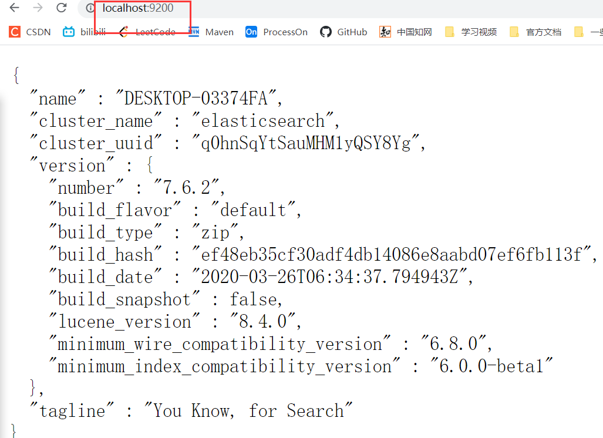


### elastic search head

安装压缩包 使用npm命令**'npm run start'**安装并运行


为了解决跨域问题，需要在es中配置：

```yaml
http.cors.enabled: true
http.cors.allow-origin: "*"
```

配置后：

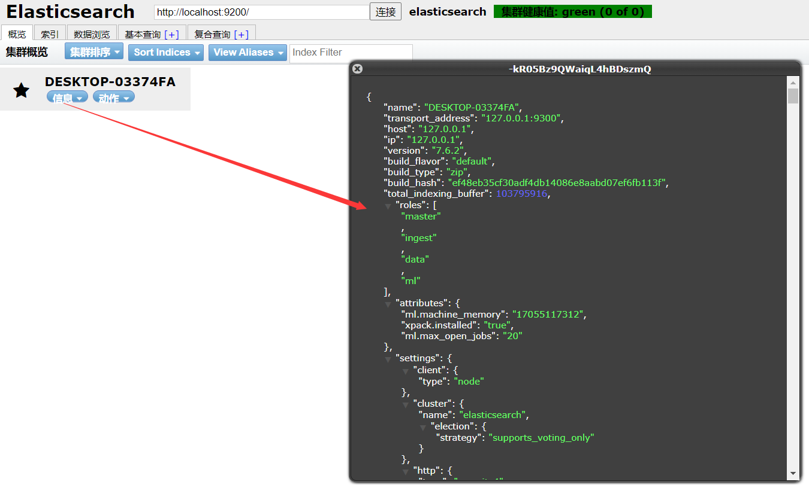


### Kibana

下载压缩包并解压，运行bat文件

访问端口5601：


开发者工具：


## ES核心概念

1. 索引
2. 字段类型（映射）
3. 文档
4. 分片（倒排索引）


elastic Search是**面向文档**的，关系行数据库和es客观对比，**一切都是json**

| Relational DB      | Elastic Search |
| ------------------ | -------------- |
| 数据库（database） | 索引（index）  |
| 表（tables）       | types          |
| 行（rows）         | documents      |
| 字段（columns）    | fields         |


#### 物理设计

es在后台把多个索引划分成多个分片，每分片可以在集群中不同的服务器间迁移

一个人就是一个集群，默认集群名为：

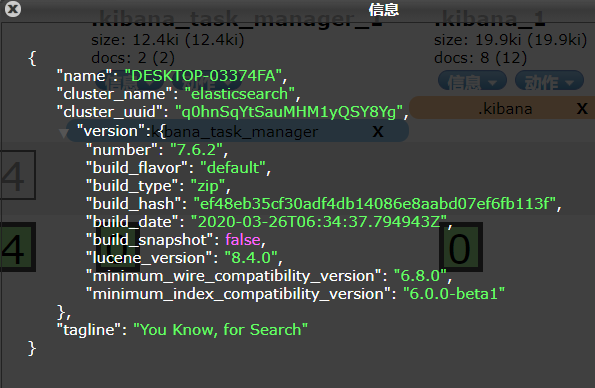


#### 逻辑设计

一个索引类型中包含多个文档。当我们索引一篇文档时，可以通过这样的顺序找到：索引->类型->文档ID。注意：id不必是整数，实际上它是个字符串。


#### 文档

索引和搜索数据的最小单位是文档。在es中文档有几个重要的属性：

- 自我包含。以前文档同时包含字段和对应的值，也就是同时包含key-value
- 可以是层次型的，一个文档中包含子文档
- 灵活的结构，文档不依赖预先定义的模式。在关系型数据库中，需要先定义字段才能使用；在es中，对于字段是非常灵活的，有时候可以忽略字段，也可以动态的添加一个新的字段

尽管我们可以随意的新增或者忽略某个字段，但是每个字段的类型非常重要。比如一个年龄字段的类型，可以是字符串也可以是整形。因为在es中会保存字段和类型之间的映射及其他的设置。这种映射具体到每个映射的每种类型，这也是为什么在es中，类型有时也称为**映射类型**。


#### 类型

类型是文档的逻辑容器。类型对于字段的定义称为映射。

先es高版本已经不推荐使用类型。


#### 索引

（类比数据库）

索引是映射类型的容器，es中的索引是一个非常大的文档集合。索引存储了映射类型的字段和其他设置。然后他们被存储到了各个分片上。

##### 物理设计：节点和分片

一个集群至少有一个节点，而一个节点就是一个es进程，节点可以有多个索引默认的，如果你创建索引，那么索引将会有5个分片（primary shard又称主分片）构成，每一个主分片会有一个副本（replica shard，又称复制分片）


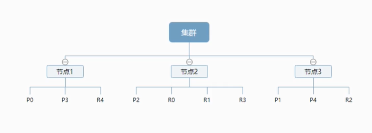

上图是一个有三个节点的集群，可以看到主分片和对应的复制分片都不会在同一个节点内，这样有利于某一个节点挂了数据也不至于丢失。实际上，一个分片是一个Luncene索引，一个包含**倒排索引**的文件目录，倒排索引的结构使得es在不扫描全部文档的情况下，就能告诉你哪些文档包含特定的关键字。

##### 倒排索引

参考链接：https://www.cnblogs.com/zlslch/p/6440114.html

es使用的是一种称为倒排索引的结构，采用Lucene倒排索引作为底层。这种结构是用于快速的全文搜索，一个索引由文档中所有不重复的列表构成，对于每一个词，都有一个包含他的文档列表。

###### 基本概念

​    文档(Document)：一般搜索引擎的处理对象是互联网网页，而文档这个概念要更宽泛些，代表以文本形式存在的存储对象，相比网页来说，涵盖更多种形式，比如Word，PDF，html，XML等不同格式的文件都可以称之为文档。再比如一封邮件，一条短信，一条微博也可以称之为文档。在本书后续内容，很多情况下会使用文档来表征文本信息。

​    文档集合(Document Collection)：由若干文档构成的集合称之为文档集合。比如海量的互联网网页或者说大量的电子邮件都是文档集合的具体例子。

​    文档编号(Document ID)：在搜索引擎内部，会将文档集合内每个文档赋予一个唯一的内部编号，以此编号来作为这个文档的唯一标识，这样方便内部处理，每个文档的内部编号即称之为“文档编号”，后文有时会用DocID来便捷地代表文档编号。

​    单词编号(Word ID)：与文档编号类似，搜索引擎内部以唯一的编号来表征某个单词，单词编号可以作为某个单词的唯一表征。

​    **倒排索引(Inverted Index)**：倒排索引是实现“单词-文档矩阵”的一种具体存储形式，通过倒排索引，可以根据单词快速获取包含这个单词的文档列表。倒排索引主要由两个部分组成：“单词词典”和“倒排文件”。

​    单词词典(Lexicon)：搜索引擎的通常索引单位是单词，单词词典是由文档集合中出现过的所有单词构成的字符串集合，单词词典内每条索引项记载单词本身的一些信息以及指向“倒排列表”的指针。

​    倒排列表(PostingList)：倒排列表记载了出现过某个单词的所有文档的文档列表及单词在该文档中出现的位置信息，每条记录称为一个倒排项(Posting)。根据倒排列表，即可获知哪些文档包含某个单词。

​    倒排文件(Inverted File)：所有单词的倒排列表往往顺序地存储在磁盘的某个文件里，这个文件即被称之为倒排文件，倒排文件是存储倒排索引的物理文件。

   关于这些概念之间的关系，通过下图可以比较清晰的看出来。

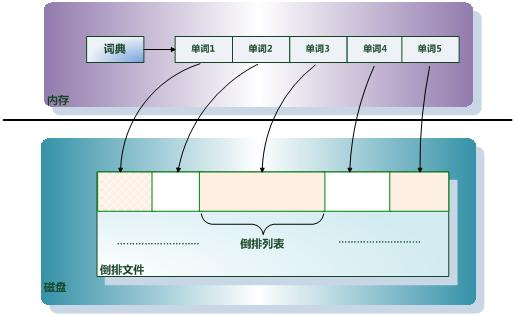


##### elastic Search的索引和Lucene的索引对比

在es中，索引这个词被频繁地使用，这就是术语的使用。在es中，索引被分为多个分片，每份分片是一个Lucene的索引。所以一个es索引是由多个Lucene组成的。


## IK分词器

### 什么是IK分词器？

分词：即把一段中文或者别的语言划分成一个个的关键字。我们在搜索的时候会把自己的信息进行分词，会把数据库中或者索引库中的数据进行分词，然后进行一个匹配操作。

IK提供了两个分词算法：ik_smart和ik_max_word，其中前者要求最少切分，后者为最细粒度划分。


### 下载安装

下载压缩包并解压到es中的plugs目录下（需要使用文件夹包装），重启es

在命令行可以看到ik已加载


### 测试

在kabana中测试

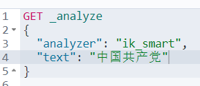


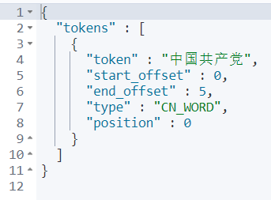


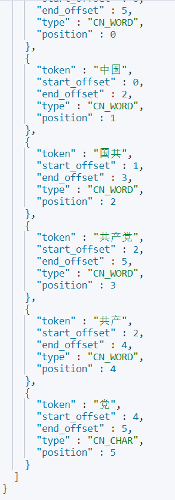


### 添加字典

当某些词是我们需要组成一个词的时候，但是分词器给分开了，这个时候需要我们进行配置，将我们需要的词语加入分词器字典中。

图示如下：

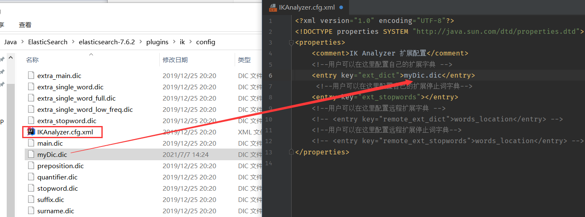

修改后重启es


## Rest风格说明

一种软件架构风格，而不是标准，只是提供了一组设计原则和约束条件。它主要用于客户端和服务器交互类软件。基于这个风格设计的软件可以更简洁，更有层次，更易实现缓存等机制。

### 测试索引基本操作

#### PUT

创建一个索引

```
PUT /索引名/类型名/文档id
{请求体}
```

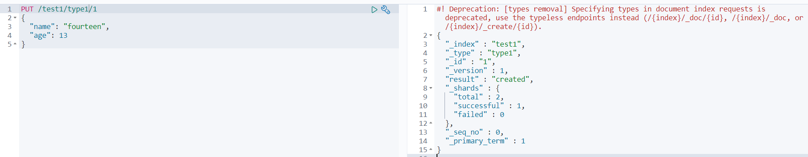

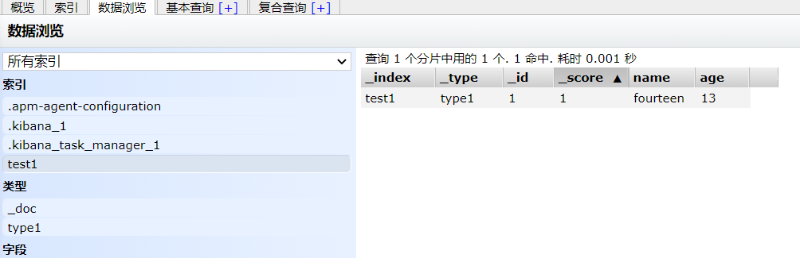


为什么name等不用指定类型

- 字符串类型	text、keyword
- 数值类型     long、integer、short、byte、double、float、half float、scaled float
- 日期类型     date
- 布尔类型    boolean
- 二进制类型   binary

指定字段的类型

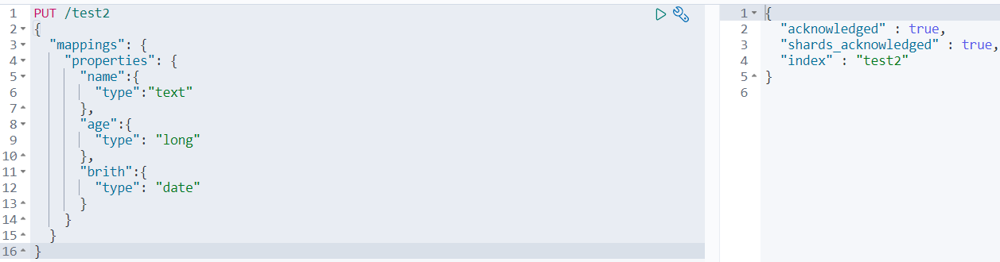

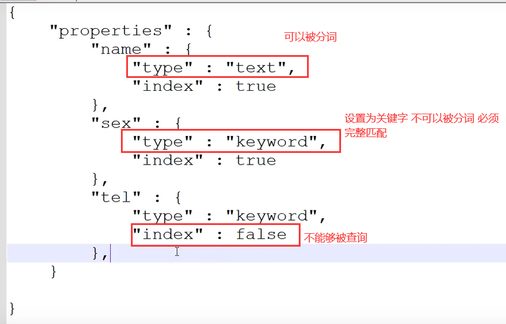


#### GET

可以通过get请求获取具体的信息

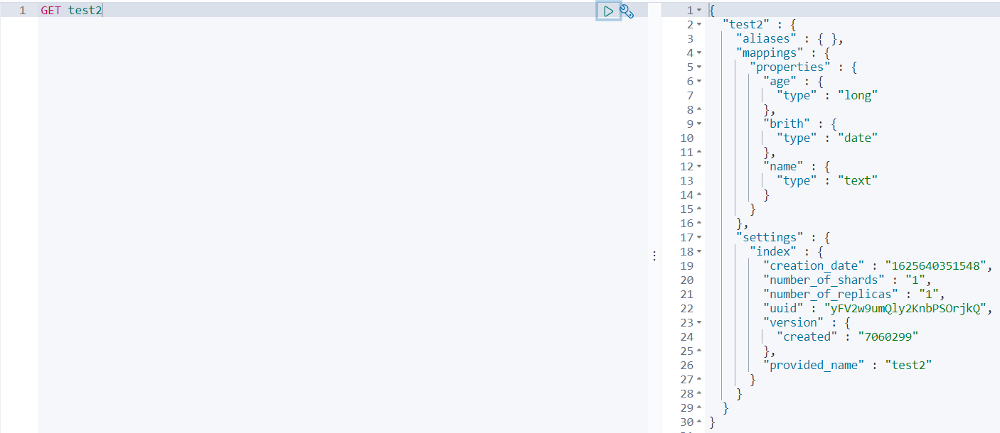


使用get获取默认的信息

如果自己的文档字段没有指定，es会默认配置

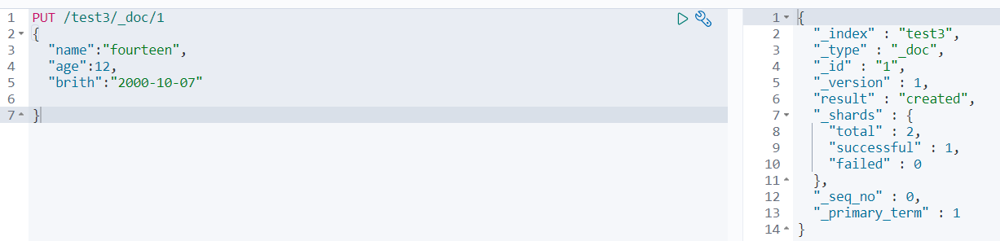

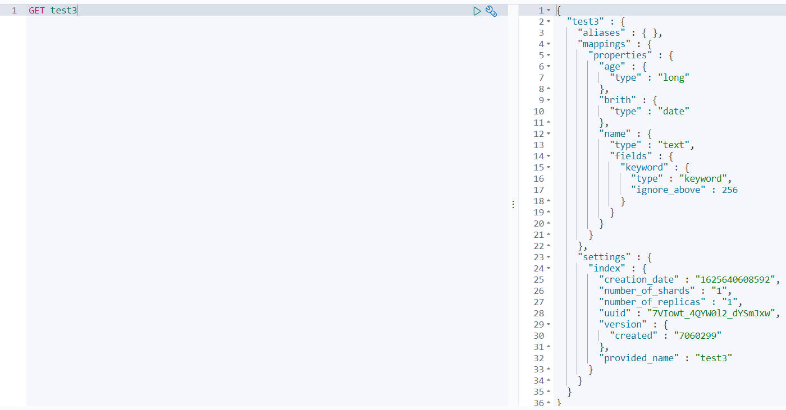


扩展：

通过get _cat/ 可以获取es当前信息

获取当前健康状态


获取当前所有集群

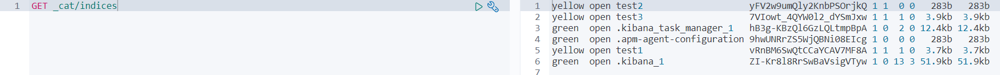


#### UPDATE

可以直接使用put


可以使用post后加update

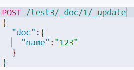


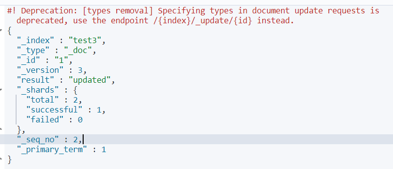

现在推荐使用 

```
/{index}/_update/{id}
```


#### DELETE

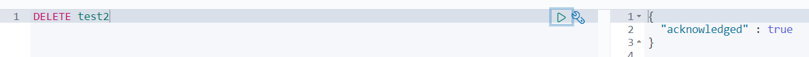

通过delete命令实现删除，根据你的请求来判断是删除索引还是删除文档记录


### 测试关于文档的基本操作

#### 首先创建

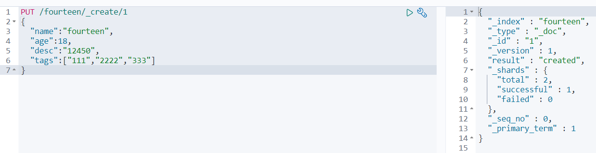

#### 添加数据

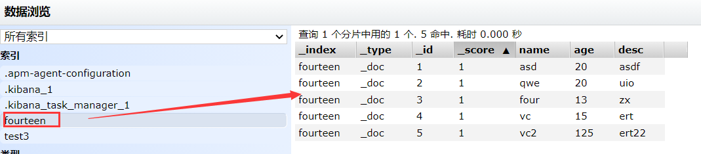

获取数据

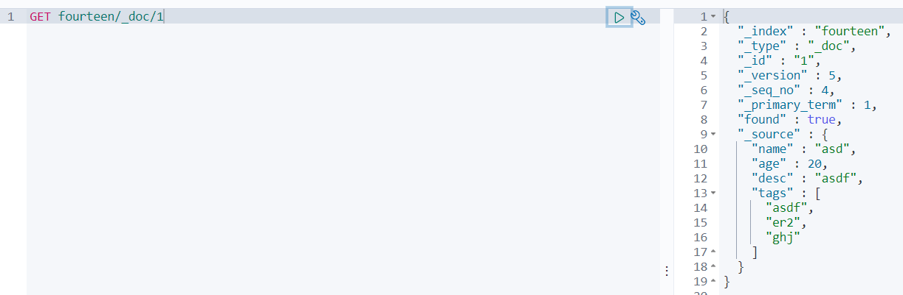

#### 更新Put

（如果其他字段没有赋值则会直接置空）

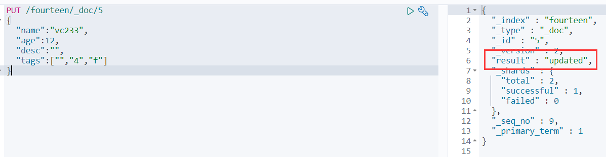

#### 更新Post

（使用update后可以修改需要修改的字段，不用担心置空问题）

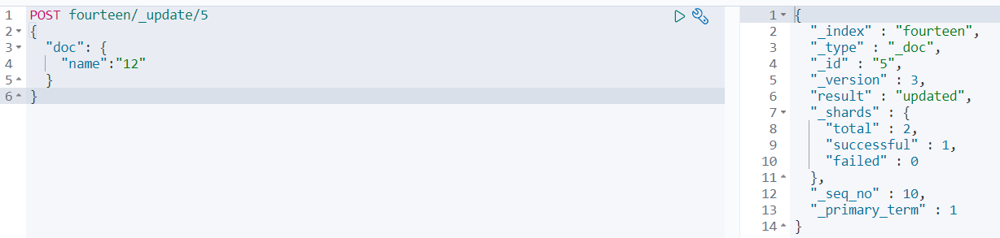

#### 简单搜索

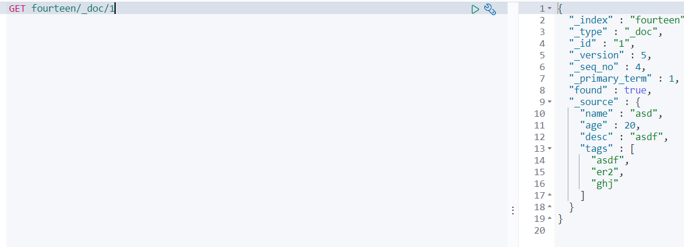

#### 简单的条件查询

GET {索引名}/_search?q={字段}:{值}


#### 复杂查询

##### 一般查询进行后的结果

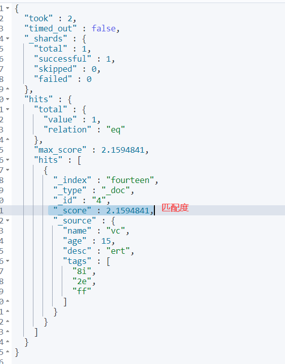

##### 使用json格式进行查询

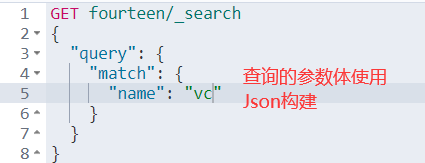

##### 查询结果解析

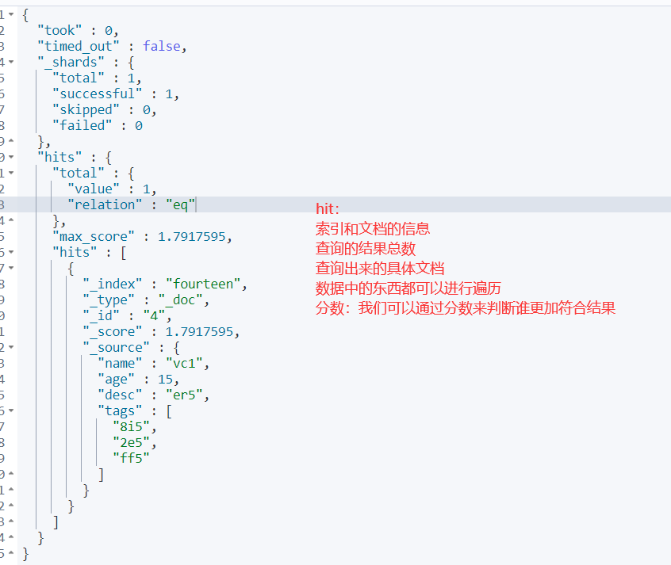

##### 结果过滤

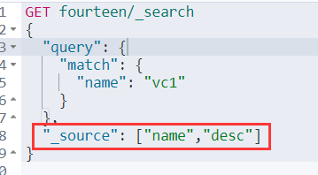

过滤后

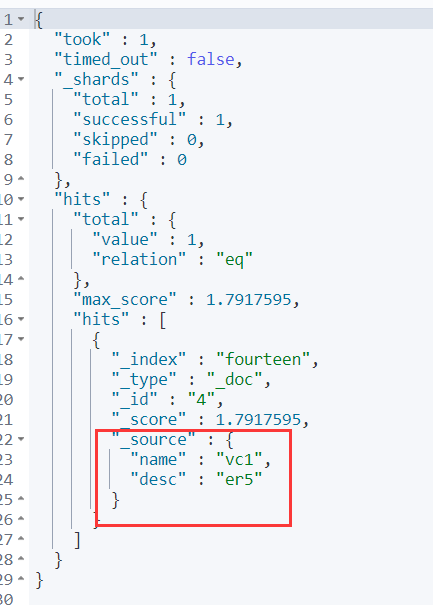

##### 排序

```
 "sort": [
    {
      "FIELD": {
        "order": "desc"
      }
    }
  ]
```

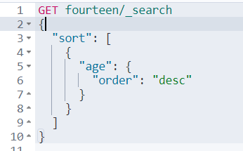

##### 分页

数据下标从0开始

from：从第几个开始

size：返回多少条数据

```
GET fourteen/_search
{
  "from": 0,
  "size": 20
}
```

##### 布尔值查询

must->（and），所有的条件必须符合 where **** and ****

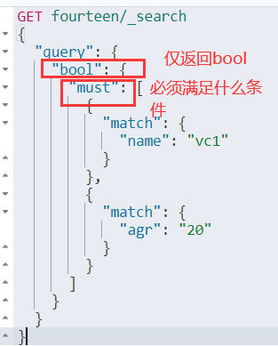

should->（or），所有的条件必须符合 where **** or ****

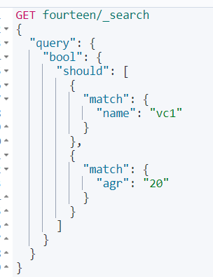

must_not->（not）

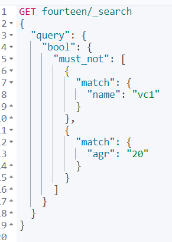


##### 过滤器

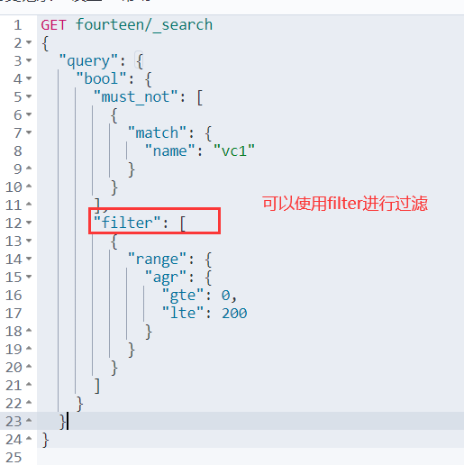

##### 匹配多个条件

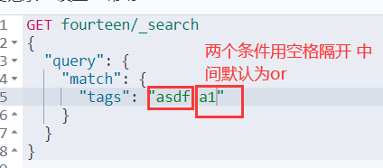

##### 精确查询

term

查询时直接通过倒排索引指定的词条进行精确查找

关于分词：

term：直接查询精确（不会使用分词器）

match：会使用分词解析器


##### 高亮查询

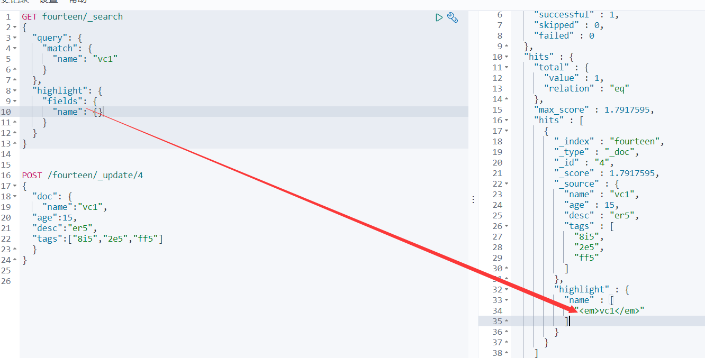

自己设置前后缀

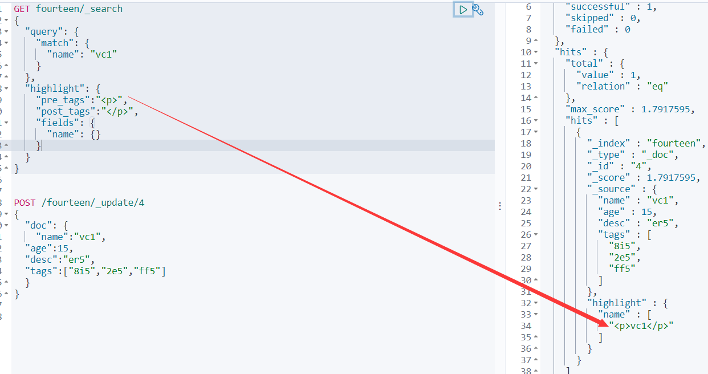

##### 聚合查询

分组查询

```
{
	"aggs":{	//聚合操作
		"price_aggs":{		//名称，随意起名
			"field":"price" //分组字段
		}
	}
	"size" : 0 		//令hits里面不需要数据
}
```

平均值

```
{
	"aggs":{	//聚合操作
		"price_avg":{		//名称，随意起名
			"avg":"price" 	//分组字段
		}
	}
}
```


## 集成SpringBoot

### 官方文档指示

- 找到原生依赖

```xml
<dependency>
    <groupId>org.elasticsearch.client</groupId>
    <artifactId>elasticsearch-rest-high-level-client</artifactId>
    <version>7.6.2</version>
</dependency>
```

- 创建对象

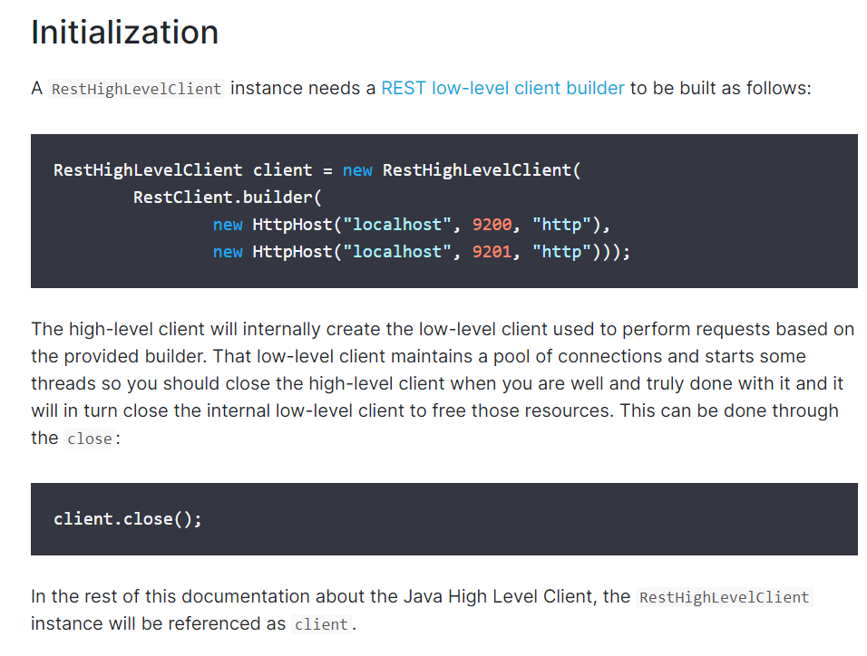

- 分析这个类中的方法


### 配置项目


es导入的版本需要和我们安装的版本一致

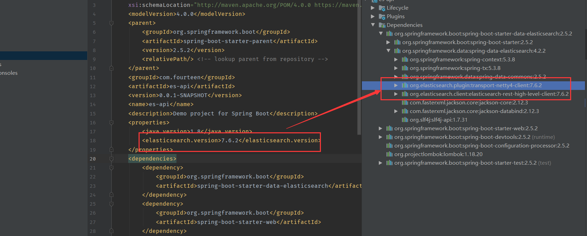

配置获取链接

```java
@Configuration
public class ESConfig {

    @Bean
    public RestHighLevelClient restHighLevelClient(){
        RestHighLevelClient client = new RestHighLevelClient(
                RestClient.builder(
                        new HttpHost("localhost", 9200, "http")));

        return client;
    }

}
```


### API测试

#### 创建索引

```java
@SpringBootTest
class EsApiApplicationTests {

	@Autowired
	RestHighLevelClient restHighLevelClient;

	@Test
	void testCreateIndex() throws IOException {
		//1.创建索引请求
		CreateIndexRequest fourteen = new CreateIndexRequest("fourteen");
		//2.执行创建请求
		CreateIndexResponse createIndexResponse = restHighLevelClient.indices().create(fourteen, RequestOptions.DEFAULT);
		System.out.println(createIndexResponse);
	}

}
```

#### 获取索引

```java
@Test
void testGet() throws IOException {
    GetIndexRequest fourteen = new GetIndexRequest("fourteen");
    boolean exists = restHighLevelClient.indices().exists(fourteen, RequestOptions.DEFAULT);
    System.out.println(exists);
}
```

#### 删除索引

```java
@Test
void testDelete() throws IOException {
    DeleteIndexRequest fourteen = new DeleteIndexRequest("fourteen");
    AcknowledgedResponse delete = restHighLevelClient.indices().delete(fourteen, RequestOptions.DEFAULT);
    System.out.println(delete);
}
```

#### 创建文档

```java
@Test
void testCreateDocument() throws IOException {
    //1.创建对象数据
    User user = new User("fourteen", 18);

    //2.创建请求 设置一些初始化数据比如文档id
    IndexRequest fourteen = new IndexRequest("fourteen");
    //规则 PUT /fourteen/_doc/id
    fourteen.id("1");
    fourteen.timeout(TimeValue.timeValueSeconds(1));

    //3.将我们的数据放入请求
    IndexRequest source = fourteen.source(JSON.toJSONString(user), XContentType.JSON);

    //4.客户端发送请求
    IndexResponse index = restHighLevelClient.index(source, RequestOptions.DEFAULT);
    //获取响应结果
    System.out.println(index.toString());
    System.out.println(index.status());
}
```

#### 获取文档信息

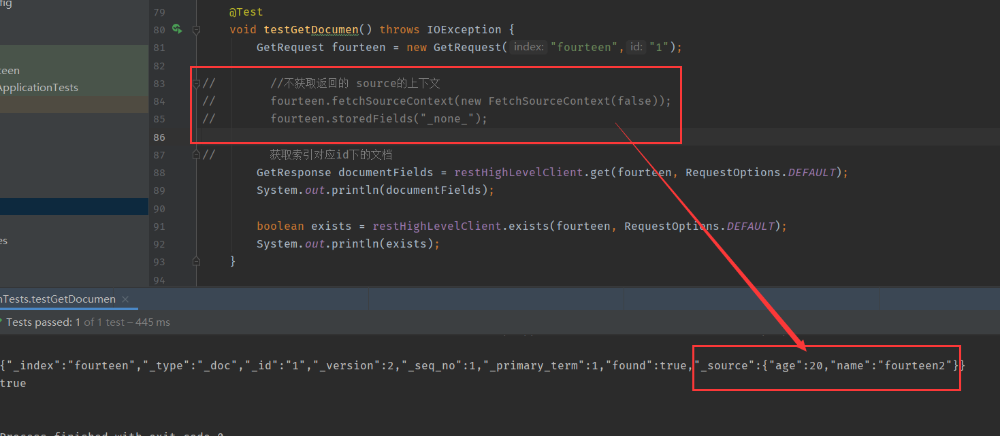

```java
@Test
void testGetDocumen() throws IOException {
    GetRequest fourteen = new GetRequest("fourteen","1");

//        //不获取返回的 source的上下文
//        fourteen.fetchSourceContext(new FetchSourceContext(false));
//        fourteen.storedFields("_none_");

//        获取索引对应id下的文档
    GetResponse documentFields = restHighLevelClient.get(fourteen, RequestOptions.DEFAULT);
    System.out.println(documentFields);

    boolean exists = restHighLevelClient.exists(fourteen, RequestOptions.DEFAULT);
    System.out.println(exists);
}
```

#### 修改文档

```java
@Test
void testUpdateDocument() throws IOException {
    UpdateRequest updateRequest = new UpdateRequest("fourteen", "1");
    User user = new User("four", 15);
    updateRequest.doc(JSON.toJSONString(user),XContentType.JSON);

    UpdateResponse update = restHighLevelClient.update(updateRequest, RequestOptions.DEFAULT);
    System.out.println(update);
}
```

#### 删除文档

```java
@Test
void deleteDo() throws IOException {
    DeleteRequest fourteen = new DeleteRequest("fourteen", "1");
    DeleteResponse delete = restHighLevelClient.delete(fourteen, RequestOptions.DEFAULT);
    System.out.println(delete);
}
```

#### 批量插入

```java
@Test
void batchSearch() throws IOException {
    BulkRequest bulkRequest = new BulkRequest();
    List<User> list = new ArrayList<>();
    for (int i = 0; i < 10; i++) {
        list.add(new User("test" + i, i));
    }

    for (int i = 0; i < list.size(); i++) {
        bulkRequest.add(
                new IndexRequest("fourteen")
                .id(String.valueOf(i))
                .source(JSON.toJSONString(list.get(i)), XContentType.JSON));
    }

    BulkResponse bulk = restHighLevelClient.bulk(bulkRequest, RequestOptions.DEFAULT);
    System.out.println(bulk);
}
```

- 批量的其它操作只需要修改**bulkRequest.add（）**里面request类型即可

#### 搜索

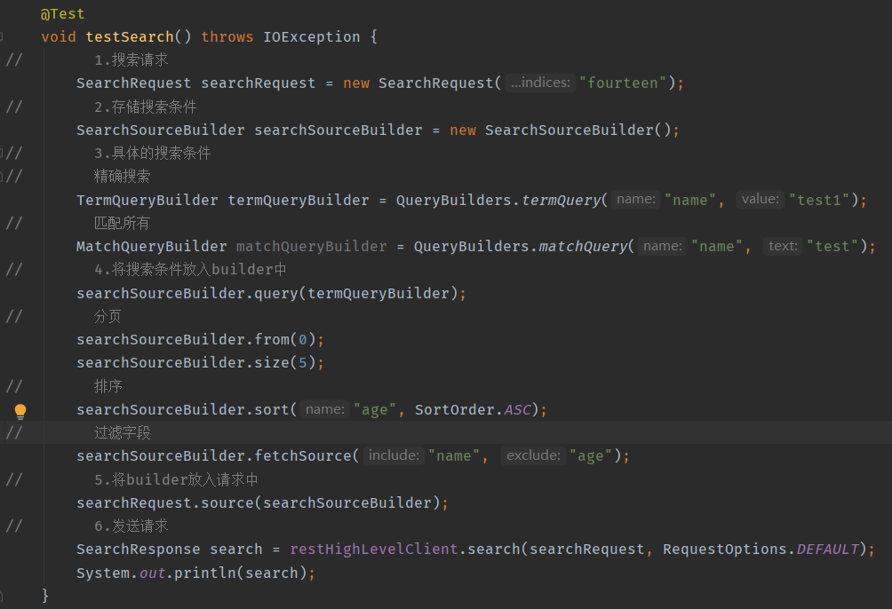

```java
    @Test
    void testSearch() throws IOException {
//        1.搜索请求
        SearchRequest searchRequest = new SearchRequest("fourteen");
//        2.存储搜索条件
        SearchSourceBuilder searchSourceBuilder = new SearchSourceBuilder();
//        3.具体的搜索条件
//        精确搜索
        TermQueryBuilder termQueryBuilder = QueryBuilders.termQuery("name", "test1");
//        匹配所有
        MatchQueryBuilder matchQueryBuilder = QueryBuilders.matchQuery("name", "test");
//        4.将搜索条件放入builder中
        searchSourceBuilder.query(termQueryBuilder);
//        分页
        searchSourceBuilder.from(0);
        searchSourceBuilder.size(5);
//        排序
        searchSourceBuilder.sort("age", SortOrder.ASC);
//        过滤字段
        searchSourceBuilder.fetchSource("name", "age");
//        5.将builder放入请求中
        searchRequest.source(searchSourceBuilder);
//        6.发送请求
        SearchResponse search = restHighLevelClient.search(searchRequest, RequestOptions.DEFAULT);
        System.out.println(search);
    }
```

#### 多条件查询

```java
@Test
void testSearch() throws IOException {
//        1.搜索请求
    SearchRequest searchRequest = new SearchRequest("fourteen");
//        2.存储搜索条件
    SearchSourceBuilder searchSourceBuilder = new SearchSourceBuilder();
//        3.具体的搜索条件
//        多条件查询
    BoolQueryBuilder boolQueryBuilder = QueryBuilders.boolQuery();
//		  也可以是should    
    boolQueryBuilder.must(QueryBuilders.matchQuery("name", "four"));
    boolQueryBuilder.must(QueryBuilders.matchQuery("age", 18));
//        4.将搜索条件放入builder中
    searchSourceBuilder.query(boolQueryBuilder);
//        5.将builder放入请求中
    searchRequest.source(searchSourceBuilder);
//        6.发送请求
    SearchResponse search = restHighLevelClient.search(searchRequest, RequestOptions.DEFAULT);
    System.out.println(search);
}
```

#### 范围查询

```java
    @Test
    void testSearch() throws IOException {
//        1.搜索请求
        SearchRequest searchRequest = new SearchRequest("fourteen");
//        2.存储搜索条件
        SearchSourceBuilder searchSourceBuilder = new SearchSourceBuilder();
//        3.具体的搜索条件
//       范围查询
        RangeQueryBuilder age = QueryBuilders.rangeQuery("age");
        age.gt(10);
        age.lt(20);
//        4.将搜索条件放入builder中
        searchSourceBuilder.query(age);
//        5.将builder放入请求中
        searchRequest.source(searchSourceBuilder);
//        6.发送请求
        SearchResponse search = restHighLevelClient.search(searchRequest, RequestOptions.DEFAULT);
        System.out.println(search);
    }
```

#### 模糊查询

```java
@Test
void testSearch() throws IOException {
//        1.搜索请求
    SearchRequest searchRequest = new SearchRequest("fourteen");
//        2.存储搜索条件
    SearchSourceBuilder searchSourceBuilder = new SearchSourceBuilder();
//        3.具体的搜索条件
//       模糊查询 .fuzziness(FuzzyQueryBuilder.DEFAULT_FUZZINESS)为限制模糊查询的差距
    FuzzyQueryBuilder fuzziness = QueryBuilders.fuzzyQuery("name", "four").fuzziness(FuzzyQueryBuilder.DEFAULT_FUZZINESS);
//        4.将搜索条件放入builder中
    searchSourceBuilder.query(fuzziness);
//        5.将builder放入请求中
    searchRequest.source(searchSourceBuilder);
//        6.发送请求
    SearchResponse search = restHighLevelClient.search(searchRequest, RequestOptions.DEFAULT);
    System.out.println(search);
}
```

#### 高亮查询

```java
@Test
void testSearch() throws IOException {
//        1.搜索请求
    SearchRequest searchRequest = new SearchRequest("fourteen");
//        2.存储搜索条件
    SearchSourceBuilder searchSourceBuilder = new SearchSourceBuilder();
//        3.具体的搜索条件
//       高亮查询
    TermQueryBuilder termQueryBuilder = QueryBuilders.termQuery("name", "four");
    HighlightBuilder highlightBuilder = new HighlightBuilder();
    highlightBuilder.preTags("<p>");
    highlightBuilder.postTags("</p>");
    highlightBuilder.field("name");

//        4.将搜索条件放入builder中
    searchSourceBuilder.highlighter(highlightBuilder);
    searchSourceBuilder.query(termQueryBuilder);
//        5.将builder放入请求中
    searchRequest.source(searchSourceBuilder);
//        6.发送请求
    SearchResponse search = restHighLevelClient.search(searchRequest, RequestOptions.DEFAULT);
    System.out.println(search);
}
```

#### 聚合查询

```java
@Test
void testSearch() throws IOException {
//        1.搜索请求
    SearchRequest searchRequest = new SearchRequest("fourteen");
//        2.存储搜索条件
    SearchSourceBuilder searchSourceBuilder = new SearchSourceBuilder();
//        3.具体的搜索条件
//       组合查询
    MaxAggregationBuilder maxAggregationBuilder = AggregationBuilders.max("maxAge").field("age");

//        4.将搜索条件放入builder中
    searchSourceBuilder.aggregation(maxAggregationBuilder);
//        5.将builder放入请求中
    searchRequest.source(searchSourceBuilder);
//        6.发送请求
    SearchResponse search = restHighLevelClient.search(searchRequest, RequestOptions.DEFAULT);
    System.out.println(search);
}
```

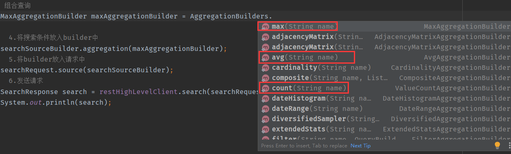


## 文件解析

- 安装插件ingest-attachment（直接在bin目录下运行）

```
elasticsearch-plugin install ingest-attachment
```

- 创建管道

```shell
PUT _ingest/pipeline/simple_attachment		//simple_attachment为管道名字
{
  "description": "单文件管道流",		//备注
  "processors": [
    {
      "attachment": {
        "field": "data",			//需要解析的数据key
        "properties": [				//将文档解析出content内容title标题content_type类型
          "content",
          "title",
          "content_type"
        ],
        "ignore_missing": true		//是否忽略fieId不存在的情况
      }
    },{
     "remove":{"field":"data"}		//传入的base64数据则去掉
    }
  ]
}
```

- 创建索引

```shell
PUT file_index_test
{
  "mappings": {
      "properties": {
        "id": {
          "type": "keyword"
        },
        "filename": {
          "type": "text",
          "analyzer": "ik_smart"
        },
        "attachment": {
          "properties": {
            "content": {"type": "text","analyzer": "ik_smart"},
            "content_type": {"type": "text","analyzer": "ik_smart"},
            "title": {"type": "text","analyzer": "ik_smart"}
          }
        }
      
    }
  }
}
```

- 插入数据（console）

```shell
PUT file_index_test/_doc/1?pipeline=simple_attachment
{
  "id": "3",
  "filename": "测试附件",
  "data":"r"
}
```

- 插入数据（Java）

```java
@Test
void test() throws IOException {
    //读入文件并将文件转化为base64格式
    File file = new File("F:\\yhxx.csv");
    FileInputStream inputFile = new FileInputStream(file);
    byte[] buffer = new byte[(int) file.length()];
    inputFile.read(buffer);
    inputFile.close();
    String encode = new BASE64Encoder().encode(buffer).replaceAll("\r|\n", "");

    //将数据放入map
    Map<String, String> map = new HashMap<>();
    map.put("id", "4");
    map.put("data", encode);

    //将map数据放入请求中并设置通道
    IndexRequest fourteen = new IndexRequest("file_index_test")
            .source(map)
            .setPipeline("simple_attachment");

    //客户端发送请求
    IndexResponse index = restHighLevelClient.index(fourteen, RequestOptions.DEFAULT);

    System.out.println(index.status());
}
```


