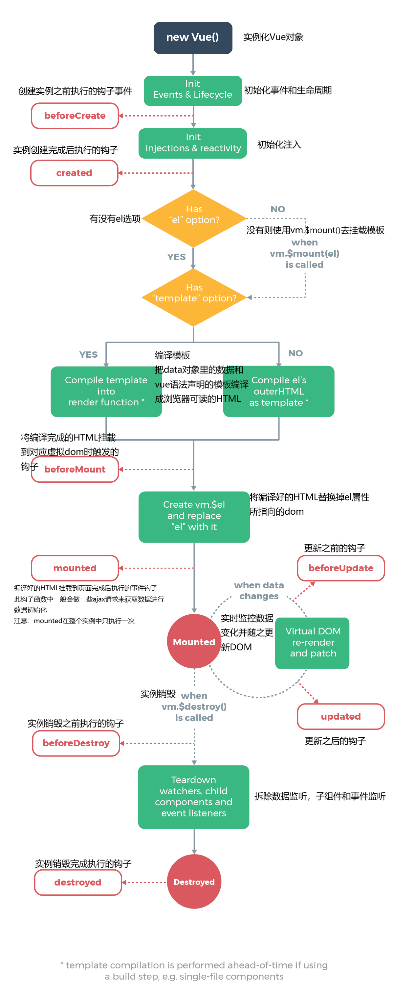
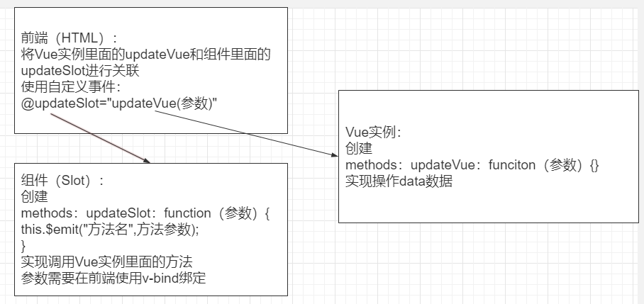
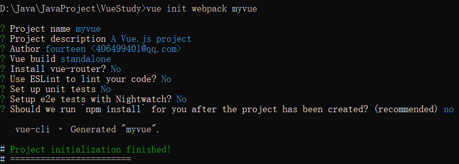
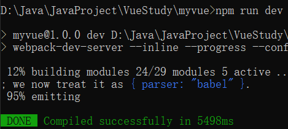
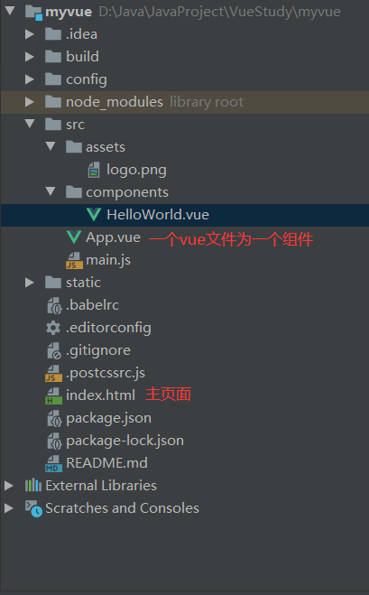
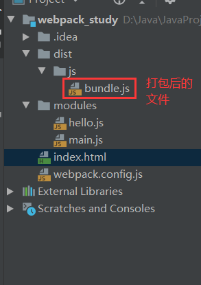
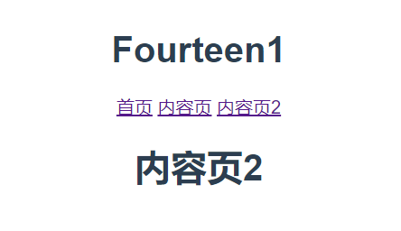

# 回顾JavaScript

## 函数和标准对象

## BOM和DOM

#### 事件

- DOM事件：增删遍历，修改节点元素内容

- 浏览器事件：window document

- jQuery

#### 视图

- html

- css

#### 通信

- xhr
- ajax
- axios


# Vue：前端体系、前后端分离

## 概述

一套用于构建用户界面的渐进式框架

Vue的核心库只关注视图层

## 前端三要素

- HTML（结构）

- CSS（表现）

  - 无法嵌套书写
  - 没有变量和合理的样式复用机制

  - ***CSS预处理器***
    - 定义了一种新的语言。用一种专门的编程语言，为CSS增加了编程的特性
    - 用一种专门的编程语言，进行Web页面样式设计，再通过编译器转化为正常的Css文件
    - SASS
    - LESS

- JavaScript（行为）

  - jQuery
  - Angular 模块化开发+MVC模式
  - React 虚拟DOM
  - Vue 模块化开发+虚拟DOM（计算属性）
  - Axios 前端通信框架

## 三端统一

混合开发

- 云打包
- 本地打包

微信小程序

## 后端技术

NodeJs

## 主流前端框架

Vue.js


# 第一个Vue程序

## Vue模式

### MVVM实现

model：模型层，JavaScript对象

view：视图层，DOM

viewmodel

- 连接视图和数据的中间件
- 能够观察到数据的变化，并对视图对应的内容进行更新
- 能够监听到视图的变化，并能够通知数据发生变化
- 视图和状态都在viewmodel中

### 为什么要使用MVVM

- 低耦合
- 可复用
- 独立开发
- 可测试

```html
<div id="app">
    {{message}}
</div>
```

```html
<script src="https://cdn.jsdelivr.net/npm/vue"></script>
<script>
    var vm = new Vue({
        el: "#app",
        data: {
            message: "hello!"
        }
    })
</script>
```


# Vue基础

## 基础指令

带有v-前缀，以表示它们是Vue提供的特殊特性

### v-bind

```html
    <span v-bind:title="message">鼠标悬停几秒钟查看</span>
```

```html
    <span :title="message">鼠标悬停几秒钟查看</span>
```

### v-if

```html
    <h1 v-if="ok">Yes</h1>
    <h1 v-else>No</h1>
```

### v-for

```html
    <li v-for="(item,index) in items">
        {{item.message}}--{{index}}
    </li>
```

### 事件 v-on

```html
<div id="app">
    <button v-on:click="sayHi">there</button>
</div>
```

```html
<div id="app">
    <button @click="sayHi">there</button>
</div>
```

```html
<script src="https://cdn.jsdelivr.net/npm/vue"></script>
<script>
    var vm = new Vue({
        el: "#app",
        data: {
            message: 'A'
        },
        methods: {
            sayHi: function () {
                alert(this.message)
            }
        }
    })
</script>
```


## Vue主要七大元素

- el
- data
- template
- methods
- render

  - 创建真正的虚拟Dom
- computed
  - 用来计算
- watch


## 双向绑定

### 什么是双向绑定

数据发生变化，视图也发生变化

视图发生变化，数据也会同步变化

双向绑定是对于UI控件，非UI控件不会涉及到双向绑定

### 在表单中使用双向数据绑定

##### v-model

```html
<input type="text" v-model="message">{{message}}
```

```html
<select v-model="fourteen">
        <option>A</option>
        <option>B</option>
        <option>C</option>
    </select>
```

使用v-model之后会把checked、selected等属性忽略，所以需要增加一个空属性避免这种情况

```html
    <select v-model="fourteen">
        <option value="" disabled>--请选择--</option>
        <option>A</option>
        <option>B</option>
        <option>C</option>
    </select>
```

##### v-bind和v-model 

- v-model在表单中使用，在表单元素上创建双向绑定
- v-bind用来绑定数据和属性以及表达式


## 组件

### 什么是组件

组件是可复用的Vue实例，即是一组可以重复使用的模板，跟jstl的自定义标签等框架有异曲同工之妙。通常一个应用会以一颗嵌套的组件树的形式来组织。

### 自定义一个组件

```html
<div id="app">
    <!--组件：传递给组件中的值：props-->
    <fourteen v-for="item in items" v-bind:values="item">
    </fourteen>
</div>
```

```html
<script src="https://cdn.jsdelivr.net/npm/vue"></script>
<script>
    <!--定义一个Vue组件component-->
    Vue.component("fourteen", {
        props: ['values'],
        template: "<li>{{values}}</li>"
    });
    var vm = new Vue({
            el: "#app",
            data: {
                items: ["java", "python", "c"]
            }
        })
    ;
</script>
```


## Axios异步通信

### 什么是Axios

一个开源的可以用在浏览器端和NodeJs的异步通信框架

- 从浏览器创建XMLHttpRequests
- 从node.js创建http请求
- 支持Promise API
- 拦截请求和响应
- 转换请求数据和响应数据
- 取消请求
- 自动转换JSON数据
- 客户端支持防御XSRF

### 为什么要使用Axios

因为Vue.js是一个视图层框架 并且作者严格遵守SoC（关注度分离原则）

### 第一个Axios应用程序

```html
    <!--    解决闪烁问题-->
    <style>
        [v-clock] {
            display: none;
        }
    </style>
```

```html
<!--v-cloak 保持和元素实例的关联 直到结束编译后自动消失 解决闪烁问题-->
<div id="vue" v-cloak>  
    <div>{{info.name}}</div>
    <div>{{info.address.street}}</div>
    <a v-bind:href="info.url">跳转</a>
</div>
```

```html
<script src="https://cdn.jsdelivr.net/npm/vue"></script>
<script src=https://unpkg.com/axios/dist/axios.min.js></script>
<script type="text/javascript"></script>
<script>
    var vm = new Vue({
        el: "#vue",
        //data:属性:vm
        //data:方法
        data() {
            return {
                //请求的返回参数格式，必须和json字符串一样
                info: {
                    name: null,
                    address: {
                        street: null,
                        city: null,
                        country: null
                    },
                    url:null
                }
            }
        },
        mounted() {//钩子函数 链式编程 ES6新特性
            axios.get('../data.json').then(response => (this.info = response.data));
        }
    });
</script>
```


## 生命周期

Vue实例有一个完整的生命周期，也就是从开始创建、初始化数据、编译模板、挂载DOM、渲染->更新->渲染、卸载等一系列过程。




## 计算属性

计算属性突出在属性两个字上，首先他是个属性，其次这个属性有计算的能力，这里的计算就是个函数；简单来说，他就是一个能够***将计算结果缓存起来的属性***（将行为转化成了静态的属性），仅此而已；可以想象为***缓存***。

计算出来的结果，保存在属性中，在内存中运行。

调用方法时，每次都需要进行计算，既然有计算过程则必定产生系统开销，那如果这个结果是不经常变化的呢？此时就可以考虑将这个结果缓存起来，采用计算属性可以很方便的做到这一点，计算属性的主要特性就是为了将不经常变化的计算结果进行缓存，以节约我们的系统开销。

```html
<div id="app">
    <p>{{currentTime1()}}</p>
    <p>{{currentTime2}}</p>
</div>
```

```html
<script src="https://cdn.jsdelivr.net/npm/vue"></script>
<script>
    var vm = new Vue({
        el: "#app",
        data: {
            message: "hello!"
        },
        methods: {
            currentTime1: function () {
                return Date.now();
            }
        },
        computed: {//计算属性 重名之后只会调用methods中的方法
            currentTime2: function () {
                this.message;
                return Date.now();
            }
        }
    });
</script>
```


## 插槽Slot

***<slot>***元素作为承载分发内容的出口，可以应用在组合组建的场景中。

### 示例代码

```html
<div id="app">
    <fourteen>
        <fourteen-title slot="fourteen-title" :title="title"></fourteen-title>
        <fourteen-items slot="fourteen-items" v-for="item in items" :item="item"></fourteen-items>
    </fourteen>
</div>
```

```html
<script src="https://cdn.jsdelivr.net/npm/vue"></script>
<script>

    Vue.component("fourteen", {
        template: "<div>\
            <slot name='fourteen-title'></slot>\
            <ul>\
            <slot name='fourteen-items'></slot>\
            </ul>\
            </div>"
    });

    Vue.component("fourteen-title", {
        props: ["title"],
        template: "<div>{{title}}</div>"
    });
    Vue.component("fourteen-items", {
        props: ["item"],
        template: "<li>{{item}}</li>"
    });

    var vm = new Vue({
        el: "#app",
        data: {
            title:"列表",
            items: ['java', 'python', 'c', '前端']
        }
    });
</script>
```


## 自定义事件

将组件中的方法和Vue实例里面的方法进行绑定

### 示例代码

```html
<div id="app">
    <fourteen>
        <fourteen-title slot="fourteen-title" :title="title"></fourteen-title>
        <fourteen-items slot="fourteen-items" v-for="(item,index) in items"
                        :item="item" :index="index" @remove="removeItems(index)"></fourteen-items>
    </fourteen>
</div>
```

```html
<script src="https://cdn.jsdelivr.net/npm/vue"></script>
<script>

    Vue.component("fourteen", {
        template: "<div>\
            <slot name='fourteen-title'></slot>\
            <ul>\
            <slot name='fourteen-items'></slot>\
            </ul>\
            </div>"
    });

    Vue.component("fourteen-title", {
        props: ["title"],
        template: "<div>{{title}}</div>"
    });
    Vue.component("fourteen-items", {
        props: ["item","index"],
        //只能绑定当前组件的方法
        template: "<li>{{item}}--{{index}} <button @click='remove'>删除</button></li>",
        methods: {
            remove: function (index) {
                //自定义事件分发  this.$emit
                this.$emit("remove",index);
            }
        }
    });

    var vm = new Vue({
        el: "#app",
        data: {
            title: "列表",
            items: ['java', 'python', 'c', '前端']
        },
        methods: {
            removeItems: function (index) {
                //一次删除一个元素
                //从index下标开始 删除一个元素 不添加元素
                console.log(this.items);
                this.items.splice(index, 1);
                console.log(this.items);
            }
        }
    });
</script>
```

### 图形表达




## 入门小结

***核心：数据驱动，组件化***

优点：借鉴了AngulaJs的**模块化开发**和React的**虚拟DOM**

常用的属性：

- v-bind 给组件绑定参数，简写**：**
- v-if
- v-for
- v-model 表单数据双向绑定
- v-on 绑定事件，简写**@**

组件化：

- 组合组件slot插槽
- 组件内部绑定事件需要使用this.emit("事件名",参数);
- 计算属性的特色，缓存计算数据

遵循SoC关注度分离原则，Vue是纯粹的视图框架，并不包含比如Ajax之类的通信功能，为了解决通信功能问题，我们需要使用Axios框架做异步通信。


# 第一个Vue-cli项目

vue-cli官方提供的一个脚手架，用于快速生成一个vue项目模板。

- 创建一个vue项目使用的几条命令

```
vue init webpack 项目名
```



​	具体选项根据实际情况修改

- 运行项目

```
cd 项目名
npm install
vue run dev
```



- 项目基础目录




# Webpack学习

## 什么是webpack

- 一个现代JavaScript应用程序的静态模块打包器
- 递归构建依赖关系图

## 代码示例

hello.js

```javascript
//exports暴露一个方法
exports.sayHi = function () {
    document.write("<h1>Fourteen</h1>");
}
```

main.js

```javascript
//导入hello模块
var hello = require("./hello"); 
hello.sayHi();
```

webpack.config.js

```javascript
module.exports = {
    //需要解释的文件
    entry: './modules/main.js',
    //解释后的文件生成位置
    output: {
        filename: "./js/bundle.js"
    },
    //告诉程序在当前目录 我属于开发状态development
    mode: "development"
};
```

index.html

```html
<!--前端的模块化开发-->
<!--导入打包后的文件-->
<script src="dist/js/bundle.js"></script>
```

目录：




# vue-router路由

编写两个组件

Main.vue

```vue
<template>
    <h1>首页</h1>
</template>

<script>
    export default {
        name: "Main"
    }
</script>
```

Content.vue

```vue
<template>
    <h1>内容页</h1>
</template>

<script>
    export default {
        name: "Content"
    }
</script>

```

主页面App.js

```vue
<template>
  <div id="app">
    <h1>Fourteen1</h1>
    <!--链接-->
    <router-link to="/main">首页</router-link>
    <router-link to="/content">内容页</router-link>
    <router-link to="/content2">内容页2</router-link>
    <!--展示跳转后的页面-->
    <router-view></router-view>
  </div>
</template>

<script>
  export default {
    name: 'App'
  }
</script>
```

主Javascript文件main.js

```javascript
import Vue from 'vue'
import App from './App'
import router from "./router"   //自动扫描里面的路由配置index.js

Vue.config.productionTip = false;

new Vue({
  el: '#app',
  //配置路由
  router,
  components: {App},
  template: '<App/>'
});

```

路由文件index.js

```javascript
import Vue from "vue";
import VueRouter from "vue-router";
import Content from "../components/Content";
import Main from "../components/Main";
import Content2 from "../components/Content2";
//安装路由
Vue.use(VueRouter);

//配置导出路由
export default new VueRouter({
  routes: [
    {
      //路由路径
      path: '/content',
      name: "content",
      //跳转的组件
      component: Content
    },
    {
      //路由路径
      path: '/main',
      name: "main",
      //跳转的组件
      component: Main
    }
  ]
});
```

结果




# 实战项目

## 创建工程

```java
1.创建一个项目
vue init webpack 项目名

2.安装依赖
//进入工程目录
cd 项目名
//安装路由
npm install vue-router --save-dev
//安装element-ui
npm install element-plus --save
//安装依赖
npm install
//安装 SASS 加载器
cnpm install sass-loader node-sass --save-dev
//启动测试
npm run dev
    
3.npm命令解释
npm install moduleName :安装模块到项目目录下
    
npm install -g moduleName : -g 的意思是将模块安装到全局，具体安装到磁盘哪个位置,要看npm config prefix的位置

npm install -save moduleName : --save 的意思是将模块安装到项目目录下，并在package文件的dependencies节点写入依赖，-S 为该命令的缩写

npm install -save-dev moduleName: --save-dev 的意思是将模块安装到项目目录下，并在package文件的devDependencies节点写入依赖，-D 为该命令的缩写
```


## 路由嵌套 

使用**children**

```javascript
{
      path:'/main',
      component:Main,
      children:[
        {
          path:"",
          component:Login
        }
      ]
 }
```


## 参数传递

### 直接关联

```vue
<!--name为组件名 params传递参数 需要将to进行绑定 实现双向绑定-->
    <router-link :to="{name:'main',params:{id:1}}">main</router-link>
```

路由index.js里面的设置

- 使用**：参数名**拼接在path后
- 需要设置name

```javascript
{
      path:'/main/:id',
      name:'main',
      component:Main
 }
```

显示获得的参数

```vue
<template>
<!--template里面只能存在一个标签 如果有多个需要使用一个标签将其他标签包起来-->
  <div>
    <h1>Main</h1>
    <h1>{{$route.params.id}}</h1>
  </div>
</template>
```

### 使用props解耦

在创建路由的时候允许props

```javascript
{
      path:'/main/:id',
      name:'main',
      component:Main,
      props:true
}
```

在跳转后的页面使用props接收参数

```vue
<template>
<!--template里面只能存在一个标签 如果有多个需要使用一个标签将其他标签包起来-->
  <div>
    <h1>{{id}}</h1>
  </div>
</template>

<script>
  export default {
    name: "Main",
    props:['id']
  }
</script>
```


## 重定向

```javascript
{
      path: '/goHome',
      redirect:'/main'
}
```


## 路由钩子

```vue
<script>
  export default {
    name: "Profile",
    //类似于过滤器
    beforeRouteEnter: (to, from, next) => {
      console.log("进入路由之前");
      next();
    },
    beforeRouteLeave:(to, from, next) => {
      console.log("离开路由之前");
      next();
    }
  }
</script>
```

参数说明:
●to:路由将要跳转的路径信息
●from:路径跳转前的路径信息
●next: 路由的控制参数
●next() 跳入下一个页面
●next('/path') 改变路由的跳转方向，使其跳到另一个路由
●next(false)返回原来的页面
●next((vm)=>{})仅在beforeRouteEnter 中可用，vm是组件实例